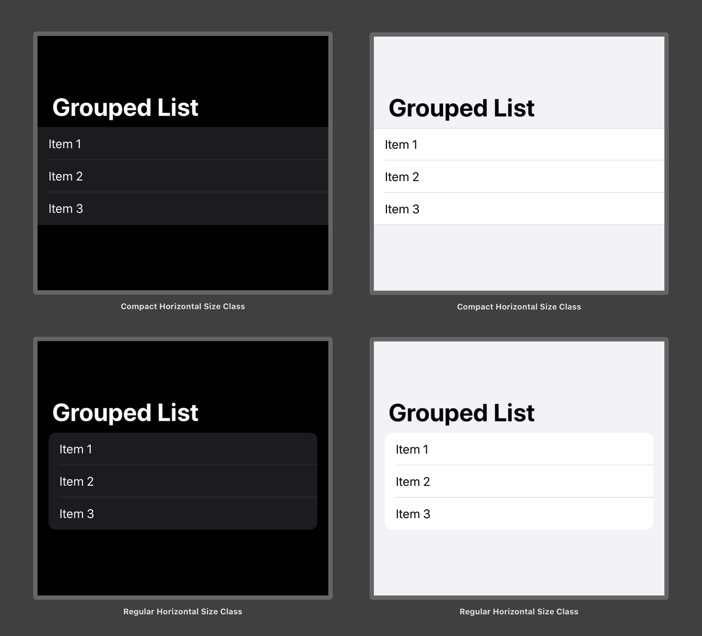

When SwiftUI shipped earlier this fall, it didn't provide any APIs to use the grouped list inset style that was added to UIKit this year. The latest release seems to have addressed that, albeit silently and not in the way that I had expected.

As of iOS 13.2, grouped lists will use the inset style when the _horizontal size class_ environment value is `.regular`, such is the case with fullscreen scenes on iPad.

[](assets/image-1573080693649.png)

If you want more control of when to use this style, you can resort to setting the environment variable to one of these two options:

```swift
List {
  Text("Item 1")
  Text("Item 2")
  Text("Item 3")
}.listStyle(GroupedListStyle())
// To enable the inset style
.environment(\.horizontalSizeClass, .regular)
// To disable the inset style
.environment(\.horizontalSizeClass, .compact)
```

Even though I am not aware of any issues that this approach might cause, I'd have preferred if Apple introduced a new `InsetGroupedListStyle` or exposed  the underlying `ListStyle` protocol instead.
