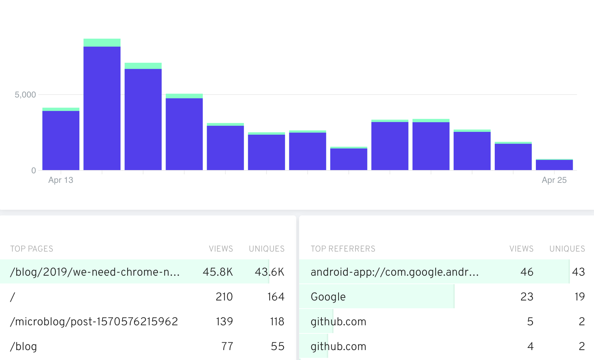

This month I noticed a sudden influx of visitors to the [We Need Chrome No More](https://redalemeden.com/blog/2019/we-need-chrome-no-more) piece form last year—46k page views is way, way above the monthly average hovering around 1k. My self-hosted instance of [Fathom](https://usefathom.com) shows some limited data about top referrers, but none of the numbers make sense, and I am totally fine with that.

