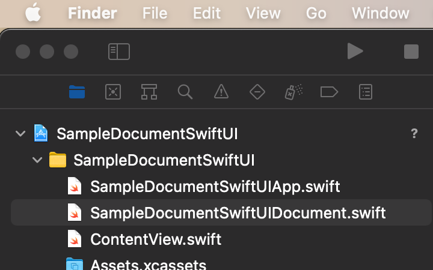

I've managed to watch most of the sessions released today and yesterday. Here are some of my personal highlights:

* _WebExtensions_ API support in Safari is excellent news for people building browser extensions. For those not familiar, it's a standard way of developing cross-browser extensions, currently supported by both Mozilla and Google.

* On the subject of Safari, several features and improvements made their way in this release. I'm particularly excited about the CSS bits, such as support for the `:is()` pseudo-selector, system font families, and [CSS Shadow Parts](https://www.w3.org/TR/css-shadow-parts-1/)—a way to allow [Web Components](https://developer.mozilla.org/en-US/docs/Web/Web_Components) to expose internal elements to the outside for styling purposes. Oh and [WebP](https://en.wikipedia.org/wiki/WebP) support.

* As part of the [Web Authentication](https://developer.mozilla.org/en-US/docs/Web/API/Web_Authentication_API) API implementation in Safari, you can now use Face ID and Touch ID for user sign-in _on your Web apps_. You heard that right.

* The new SwiftUI app life cycle is nothing short of impressive. I have been upgrading all my unreleased apps to this new API—since it's iOS 14 only—and it's been eye-opening to see how far this declarative approach goes in getting rid of boilerplate.

* Contextual menus are now generalized in iOS and can be invoked from any button without requiring a long press or adding an overlay on top of the view. This is my favorite new addition to iOS this year—by far. Action sheets were always clunky to work with, and popovers felt off on the iPhone. It's worth noting that SwiftUI doesn't seem to have access to this new API as of this beta (Feedback: `FB7776866`).

* I've been using Big Sur since Monday; smooth sailing so far. Even though I am  starting to like the new aesthetic, I still can't stand the myriad contrast issues littering the new Menu Bar (Feedback: `FB7762626`). Reducing transparency in the accessibility preferences solves most of these issues, but the default is what most people will be stuck with—and it's bad (see below).

  
