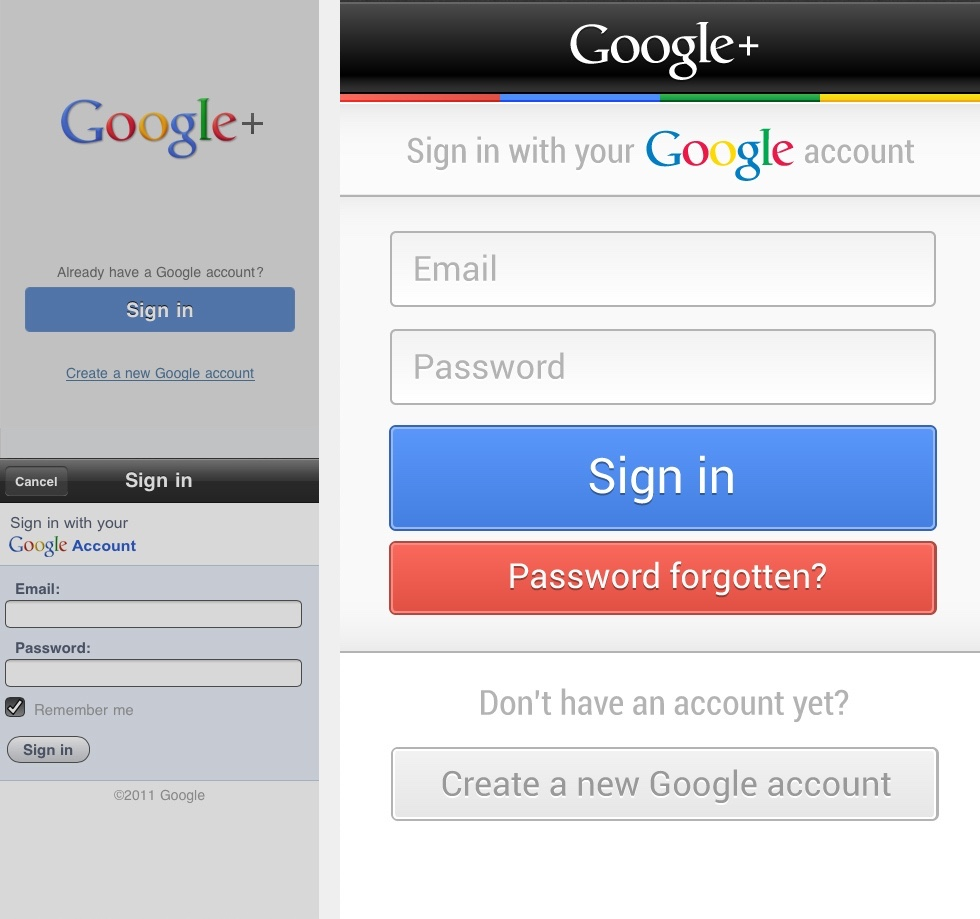

Your mileage may vary, but I think Google has what it takes to compete against Facebook in the social network space. Smart interactions and streamlined privacy controls drastically improve user experience on a social interface and Google seems to be pouring considerable resources in this direction.

Notwithstanding, the iOS client of Google+ is blatantly falling short of the standards set by the Web interface. Given that Facebook have just rolled out a decent update to their iOS app, Google is clearly losing the edge on the mobile front. They may have the best talent in the industry, but for some reason they don't seem to be giving the iPhone app the attention it deserves. It's a mishmash of Web views, experimental touch interactions, and unpolished graphics, resulting in a sub-par user experience.

### Signing In

To start off, users have to go through two completely useless screens to get to the sign-in form. In order to create an account, you have to hunt down a blue underlined link in the second screen, only to be taken to a poorly designed Web form. The obvious solution would be greeting users with the actual sign-in form as shown in the mock-up below.

 _Sign-in screen redesign._

I attempted to stay as close as possible to the colorful visual style that Google has been pushing as of late, which happens to be a step in the right direction.

### The Stream

Dashboard navigation on mobile apps is as hacky as a design pattern can get, especially when a tab bar can perfectly fit the bill. As for the default tab, it would be safe to assume that users will be spending most of their time on the stream. The mockup below shows how a native tab navigation could save users a few taps and leverage what they already learnt on iOS.

 _Navigation redesign._

Notifications would appear next to the logo in the top navigation bar, making them hard to miss throughout the different sections of the app. Content should be given more prominence by using the full-width of the screen. Ideally, raw URLs should be hidden as long as the actual content of the link is displayed inline.

### Touch Interactions

Buttons might be a hack, but it'd be safe to assume that users won't be switching streams often enough to justify gesture-driven navigation. Instead, touch gestures should be used to perform the frequent action of plus-one-ing posts. A popover would come to the rescue as a perfectly scalable design pattern to handle circle switching. Other post-specific actions such as commenting or sharing would be revealed with a single tap in order to reduce visual clutter---a pattern used brilliantly by Tweetbot.

 _Circle-switching and post-specific actions._

While these concepts are in no way a panacea for the current interface shortcomings, they could be a very good start if Google decides to get more serious about its fledgling social network.
