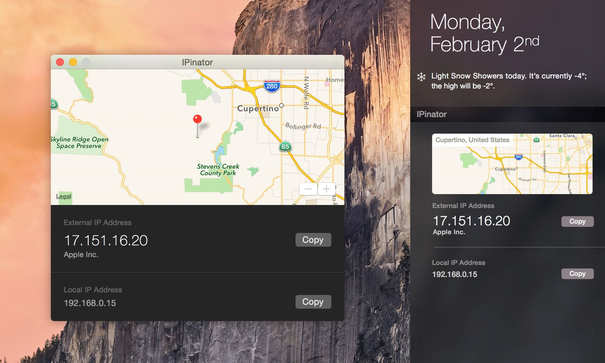

I am happy to announce that [IPinator] is *finally* [live on the App Store][appstore]. It's a utility app and Notification Center widget that geocodes your external IP address and displays it alongside your local one for easy copy-pasting during local development, VPN setup, etc.

 _Application window and Notification Center extension._

IPinator is written in Swift and uses [Argo] for JSON parsing and [Llamakit] for `Result`. The code-base is straightforward, save for one limitation related to the inability to display an `MKMapView` in a Today extension. The solution I came up with involved generating a map screenshot and passing it to the extension as an `NSImage`.

If you'd like to write about IPinator, feel free to [drop a line][contact] for a promo code.

[ipinator]: http://ipinator.kaishin.co
[appstore]: https://itunes.apple.com/us/app/ipinator/id959111981
[argo]: https://github.com/thoughtbot/Argo
[llamaKit]: https://github.com/LlamaKit/LlamaKit
[contact]: http://ipinator.kaishin.co/support
