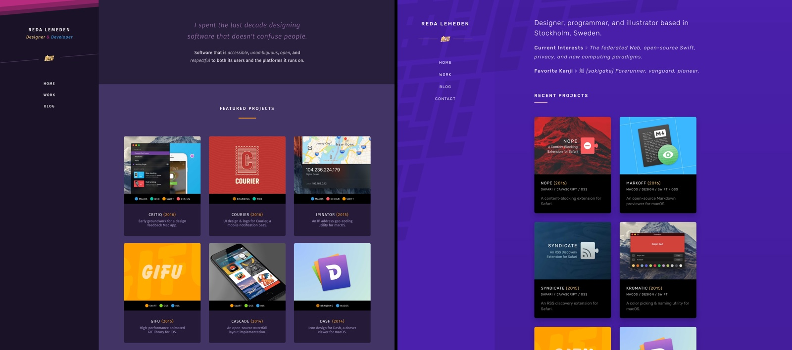

*[Assumed Audience](https://www.chriskrycho.com/2018/assumed-audiences.html) --- People who have been following my work and/or are interested in independent blogging.*

Today marks a new beginning for this blog. After a long hiatus, I am finally back to writing, and I couldn’t be happier about it.

Six weeks in, I can confidently say that 2019 is off to a good start for me. I am slowly breaking free of the constant feeling of anxiety and pressure that paralyzed me a great deal throughout last year. Healthy habits were key in this process. Today, I have a concrete action plan to achieve my goals and ambitions. And it starts here.

Since last fall, I’ve been deliberately distancing myself from Twitter. My over-reliance on it as a medium for hot takes and shallow interactions inhibited my drive to write longer, more reflective pieces. The result is a trail of abandoned blogs and writing experiments that didn’t get the attention they deserve.

To address that, I will commit to writing one short essay per month, for the next 12 months, about one of the topics that have been preoccupying me---the first of which is drafted and will be out shortly after this one.

On top of that, I started the process of migrating older essays and entries to this blog, setting up permanent redirects when necessary. The RSS feed has moved to a [new URL][RSS] and is now also available as a [JSON Feed][JSON].

Beside these changes, the website itself got a much needed facelift. The new design uses a more vivid color palette with an increased focus on contrast. It also introduces a unified type system across all pages of the site; something that was hard to achieve when three font families were in simultaneous use. As a bonus, all fonts are now self-hosted instead of being served through Google Fonts.

 _Old design, new design._

Under the hood, I started using a self-hosted instance of [Fathom] to add a thin, privacy-minded layer of metrics. The anonymous data will be used to gauge interest in certain topics and keep an eye on the overall activity happening on the site.

In closing, I'm very pleased with the outcome, and I'm pumped to resume writing about things that matter to me. Onward and upward!

[RSS]: /feed.xml
[JSON]: /feed.json
[Fathom]: https://usefathom.com/
