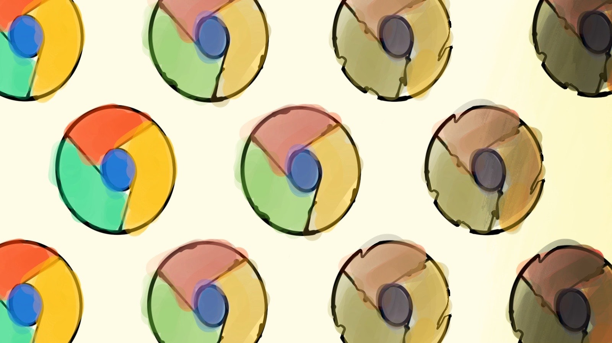

*[Assumed Audience](https://www.chriskrycho.com/2018/assumed-audiences.html) --- People interested in the open Web as a platform.*

Ten years ago, we needed Google Chrome to break the Web free from corporate greed, and we managed to do so for a brief period. Today, its dominance is stifling the very platform it once saved from the clutches of Microsoft. And no one, beside Google, needs that.

It’s 2008. Microsoft still held a firm grip on the browser market. Six years had gone by since Mozilla released Firefox, a direct competitor to Internet Explorer. Google---the search engine company that everyone grew to love at the time---announced that they’re entering the ring. Chrome was born.

Within two years, Chrome accounted for 15% of all Web traffic on desktop---for comparison, it took Firefox 6 years to get there. Google managed to deliver a fast, thoughtfully designed browser that was an instant hit among users and Web developers alike. Their product innovation and engineering prowess was a breath of fresh air, and their commitment to open-source was the cherry on top. Over the years, Google‘s adoption of Web standards continued to set the example.

Fast-forward a decade later. The browser landscape looks vastly different. Chrome is the most ubiquitous browser on the planet, making Google the de facto gatekeeper of the Web on both mobile and desktop in all but a handful of regions around the world. The browser comes preinstalled in most Android handsets sold outside of China, and serves as the UI layer of *Chrome OS*, Google’s foray into desktop and tablet operating systems. What started as an avant-garde, standard-compliant browser is now a sprawling platform that spares no area of modern computing.

While the Chrome browser itself is not open-source, most of its innards are. Chromium, the non-proprietary subset of Chrome, was open-sourced early on with a generously permissive license as a sign of commitment to the open Web community. As a full-featured browser, Chromium became widely popular among Linux users. As an open-source project, it has gained a large following in the open-source ecosystem, often used as a the foundation of other browsers and applications.

Both Chrome and Chromium run Blink under the hood, the rendering engine that started as a WebKit fork in 2013 when Google grew dissatisfied with the Apple-led project. Blink continued to grow since and will pick even more steam when Microsoft will [start using it][edge] for their Edge browser.

The Chrome platform has profoundly changed the Web. And then some. The adoption of Web technologies in desktop software development has seen an unprecedented rise in the last 5 years, with projects like Github’s Electron sweeping every major desktop OS as the de facto standard for cross-platform applications. Chrome OS, while still tiny compared to Windows and macOS, is gaining both mind and market share.

Chrome is effectively everywhere you look. And that’s bad news.

## Don’t Be Evil

The dominance of Chrome has a major detrimental effect on the Web as an open platform: developers are increasingly shunning other browsers in their testing and bug-fixing routines. If it works as intended on Chrome, it’s ready to ship. This in turn results in more users flocking to the browser as their favorite Web sites and apps no longer work elsewhere, making developers less likely to spend time testing on other browsers. A vicious cycle that, if not broken, will result in most other browsers disappearing in the oblivion of irrelevance. And that’s exactly how you suffocate the open Web.

When it comes to promoting this mono-browser culture, Google is leading the pack. Poor quality assurance and questionable design choices are just the tip of the iceberg when you look at Google’s apps and services outside the Chrome ecosystem. Making matters worse, the blame often lands on other vendors for “holding back the Web”. The Web is Google’s turf as it stands now; you either do as they do, or you are called out for being a laggard.

Without a healthy and balanced competition, any open platform will regress into some form of corporate control. For the Web, this means that its strongest selling points—freedom and universal accessibility—are eroded with every per-cent that Chrome gains in market share. This alone is cause for concern. But when we consider Google’s business model, the situation takes a scary turn.

The raison d’être of any business is to make profit and keep shareholders happy. When growth happens to align with a good cause, it’s considered a competitive advantage. When it doesn’t, the PR and marketing departments are put to work. Google’s mantra of “Don’t be evil” fit their narrative at a time when their growth aligned with making the Web more open and accessible.

Alas, not anymore.

The company’s focus gradually shifted towards transforming their browser dominance into business growth. It also happens that Google’s business *is* search engine advertising and AdSense. Everything else is a measly 10% of their annual revenue. That in and of itself is not an issue, but when the line between the browser, the search engine, and online services is blurred, we have a problem. And a big one at that.

Successful businesses capitalize on their competitive advantages.  Unscrupulous ones abuse them when given free rein. When your browser [forces you to sign in], places cookies that [you can’t delete], and seeks to [neutralize ad-blocking and privacy extensions], something’s gone terribly wrong[^1]. Even more so when you factor in the fact that every website contains at least one snippet of code that pings Google’s servers to track visitors, show them ads, or serve them custom fonts.

In theory, these malpractices could be overlooked if the company involved had a good track record with handling personal data. In practice, however, Google is institutionally creepy, and they can’t help themselves. You might think that your personal data is nobody's business, but they don’t seem to agree.

Google’s business model requires a steady stream of data that can be analyzed and used to serve targeted ads. As a result, everything they do has to ultimately lead to expanding their user base and the time they spend on their properties. Even as personal computing shifted to mobile, Chrome remains an important cog in Google’s data aggregation machinery. Websites you visit and keywords you search are tracked and used to offer you a more “personalized” experience. Without a clear boundary between the browser and the search engine, it’s impractical to keep track of which knows what about you. In the end, we accept the trade-off and move on with our lives, just as Google’s product designers and engineers wanted.

In short, Google have proven, on several occasions, that they have no empathy towards their end users. Their utmost priority was and remains advertisers’ interests.

## A Look Ahead

Healthy, user-centric competition is what brought us the best products and experiences since the early days of computers. With Chrome dominating the browser market at 60% and Chromium invading desktop computing on all 3 major platforms, we are entrusting a lot to a single company and ecosystem. An ecosystem that doesn’t seem concerned with performance, user experience, privacy, or pushing computing forward.

But we still have time to turn things around. We did this a decade ago and we *can* do it again.

Both Mozilla and Apple are doing a remarkable job at closing the Web standards gap that widened in the early years of Chrome. They are even noticeably ahead in areas such as performance, battery usage, privacy, and security.

If you’re stuck with Google services that don’t work on other engines, or rely on the Chrome DevTools to do your job, consider using Vivaldi[^2] instead. It’s not ideal—Chromium is still a Google property—but a step in the right direction nonetheless. Supporting smaller vendors and fostering browser diversity is critical to reverse, or at least slow down, the unhealthy growth of Chrome.

I’ve been Chrome-free since 2014, and I’ve never looked back. Chances are you will do just as fine without it. You might like it as a browser. And you might not mind the privacy trade-offs it comes with. But the stakes are much higher than our individual preferences and affinities; an entire platform is on the verge of becoming yet another walled garden. And we have enough of those already. So let’s do what we can, while we can, to prevent that.

### Sources & Further Reading

- ["Usage share of web browsers,"](https://en.wikipedia.org/wiki/Usage_share_of_web_browsers) *Wikipedia*.
- ["Chrome is Not the Standard,"](https://www.chriskrycho.com/2017/chrome-is-not-the-standard.html) *Chris Krycho*.
- ["Why I’m done with Chrome,"](https://blog.cryptographyengineering.com/2018/09/23/why-im-leaving-chrome/) *Matthew Green*.
- ["Browser Diversity Starts with US,"](http://www.zeldman.com/2018/12/07/browser-diversity-starts-with-us/) *Jeffrey Zeldman*.

[edge]: https://blogs.windows.com/windowsexperience/2018/12/06/microsoft-edge-making-the-web-better-through-more-open-source-collaboration/
[forces you to sign in]: https://blog.cryptographyengineering.com/2018/09/23/why-im-leaving-chrome/
[you can’t delete]: https://news.softpedia.com/news/chrome-69-does-not-delete-google-cookies-when-clearing-all-website-data-522884.shtml
[neutralize ad-blocking and privacy extensions]: https://www.cnet.com/news/google-may-break-ad-blockers-with-upcoming-chrome-change/

[^1]: I am aware that after the user backlash, Chrome 70 reverted some of these. My point still stands.
[^2]: Opera and Brave are two other alternatives, but the former is owned by an online advertising and gaming consortium based in China, and the latter is experimenting with [unconventional ad-based business models](https://www.cnet.com/news/braves-privacy-focused-ads-to-spread-beyond-startups-own-browser/).
