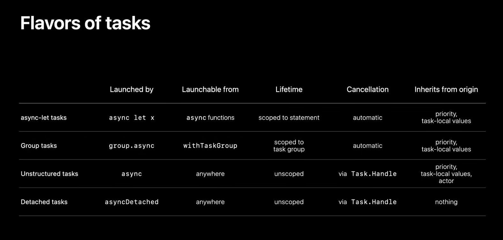

We're half way already! Today I mostly watched concurrency sessions, with some SwiftUI bouts here and there.

- [Apple’s privacy pillars in focus](https://developer.apple.com/wwdc21/10085): The deeper dive into how private relay works in iCloud+ was quite fascinating.

- [Craft search experiences in SwiftUI](https://developer.apple.com/wwdc21/10176) Pretty impressive how little code is needed to achieve a platform-native search experience on all Apple platforms. If this is the future of the framework, sign me up!

- [Demystify SwiftUI](https://developer.apple.com/wwdc21/10022) Really informative session about SwiftUI view identity and lifetime. It also introduces new terminology—such as "inert modifier"—that will come in handy when discussing these topics.

- [Meet AsyncSequence](https://developer.apple.com/wwdc21/10058) A short and sweet session about `AsyncSequence`. I was wondering how this fits with Combine, especially given the lack of updates on that front, but unfortunately this didn't shed any light on that.

- [Explore structured concurrency in Swift](https://developer.apple.com/wwdc21/10134) This session had my favorite slide in the conference so far in terms of information density.

- [Meet Xcode Cloud](https://developer.apple.com/wwdc21/10267) Built-in continuous integration in Xcode is long overdue, and I am eager to try this out.

- [Protect mutable state with Swift actors - WWDC 2021 - Videos - Apple Developer](https://developer.apple.com/wwdc21/10133) At this point it's probably clear that concurrency is topping my list of interests this year. This one focuses on _actors_, which make working with synchronized data access much easier.
