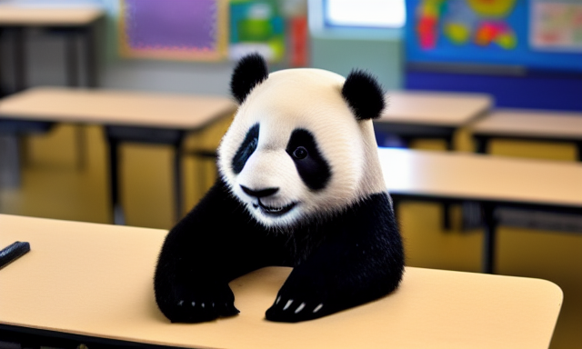
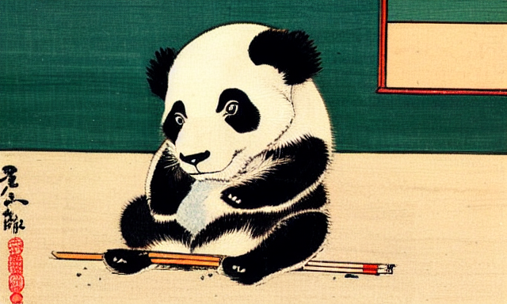
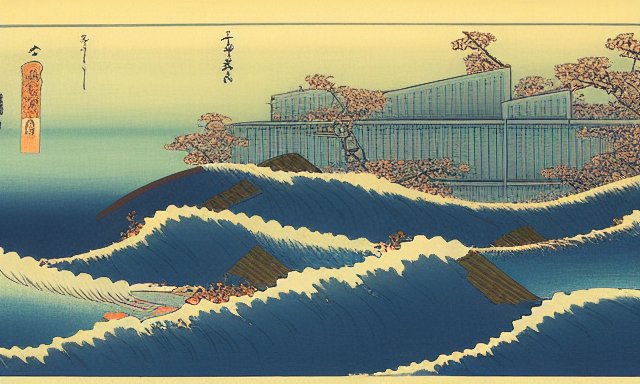
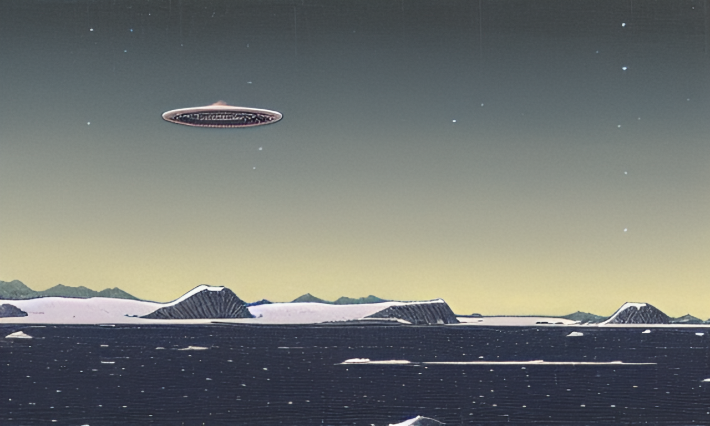
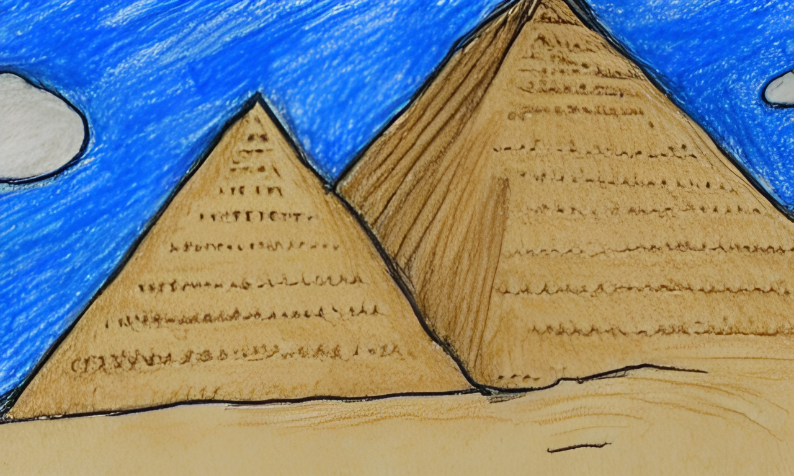
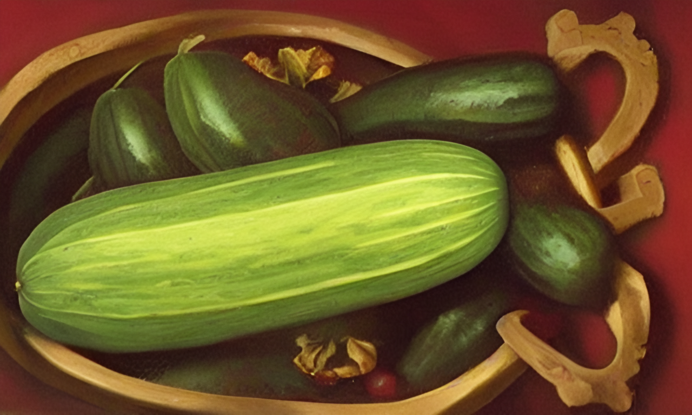

In the past two weeks, something incredible happened in the machine learning space: an open-source image generation model that can compete or even outperform closed-source alternatives such as OpenAI’s DALL-E or Google’s Imagen has been [released to the public](https://stability.ai/blog/stable-diffusion-public-release). This development generated—no pun intended—an unprecedented wave of excitement and buzz in the space. [You don’t have to take my word for it](https://thealgorithmicbridge.substack.com/p/stable-diffusion-is-the-most-important).

Developer by [Stability.Ai](https://stability.ai), [Stable Diffusion](https://stability.ai/blog/stable-diffusion-announcement) can generate highly detailed images from simple text prompts. But the real novelty is that it can do so on consumer-grade graphic cards. 🤯 Prior to this, most _latent diffusion models_, as they are called, required much more powerful machines to do their work.

To illustrate why this is a big deal, here is one of the results[^1] my 5 years old GTX 1080 graphics card generated for the prompt “A photo of a panda sitting in a primary school classroom”:

 _A photo of a panda sitting in a primary school classroom_

A you can see, the model  managed to understand what the prompt meant. It got the panda sitting, the classroom, and even the focus blur for that perfect photograph feel. The fascinating part, is that even small variations in the prompt or the parameters produce widely different results. For instance, consider the following prompt-output combination.

> A painting by Katsushika Hokusai of a panda sitting in a classroom in primary school

 _in a primary school classroom_

Not only the model recognized and reproduced the style of the famous Japanese artist, but it managed to do so while capturing the historical context by eliminating all modern details from the image. If we try with a completely different prompt that purposefully include words like “cyberpunk” and “futuristic”, it still manage to stay faithful to the aesthetics of the [Ukiyo-e](https://en.wikipedia.org/wiki/Ukiyo-e) art form.

> A painting by Katsushika Hokusai of a cyberpunk futuristic city

 _A painting by Katsushika Hokusai of a cyberpunk futuristic city_

But the use cases of Stable Diffusion don’t stop here. It can generate images based on other images (_image-to-image_), fill empty pixels inside an image (_inpaiting_), fill empty pixels outside an image (_outpainting_), interpolate between images, and so forth. These building blocks open the door to large swaths of applications in more than one creative field.

Image-to-image generation is particularly powerful as it allows the user to have a say in the final output, eliminating the guesswork and making the prompt writing process much easier. To illustrate, consider this example below where I started with a crude manual drawing to the left, added the prompt _“a rainbow-colored umbrella”_, and ended with the generated image to the right (granted after a half a dozen tries).

 _Left: input image. Right: Image generated by Stable Diffusion._

## How to Get Started

Being an open-source model, it took only a couple of weeks for a barrage of wrappers, forks, GUIs, and CLIs to emerge. Unfortunately, the tooling can still be arcane to most people, even non-ML developers. There is a non-trivial amount of fiddling with python environments and other dependencies to get the intended results.

The most straightforward way to take SD for a spin is via the official [DreamStudio](https://beta.dreamstudio.ai/dream) web-based interface. You get 200 credits when you create a new account, where each credit corresponds to one 512px by 512px image. Another option is via the [official Discord server](https://discord.gg/stablediffusion) which features a bot command that parses prompts and displays the generated images directly in the channel.

If you’re familiar with Python tooling or just feeling adventurous, and have a computer with enough GPU juice to run the model[^2], [this fork](https://github.com/lstein/stable-diffusion) has more thorough setup instructions than many others I tried.

## Alternatives

As it stands now, Stable Diffusion is the only open-source latent diffusion model around. Alternatives in the closed-source side of the fence include the buzz-worthy [Midjourney discord server](https://discord.me/yp2funhwwf), which seems to excel at generating stunning artwork using very minimal prompts; something SD still needs a bit more help with in my tests using the v1.4 model weights.

[DALL·E](https://openai.com/blog/dall-e-now-available-in-beta/) is the other commercial alternative—albeit only for those who got access to the closed beta.

## Gotchas

Generating images that are jaw-droppingly good takes a lot of iterations, prompt _engineering_, and parameter adjustments. It's quite rare for the first image to match what you had in mind when you wrote the prompt. The model also seems to have trouble with human limbs and fingers, often drawing more or less than necessary. Anatomy in general seems to be a hit or miss. Another shortcoming is the often-incorrect interpretation of relations between various objects and actors in the prompt.

That being said, It’s been only a couple of weeks, and these early limitations are already in the radar of the Stability Ai team and the community.

## Learn More

Since the public release, it’s been hard to run out of resources, guides, and tools related to SD. And quite frankly, it's overwhelming for someone new to machine learning like myself. But ff you're curious about the topic and would like to learn more, you might find [my growing collection of links]((/collections/stable-diffusion/)) of some use!

Last but not least, why bother with closing words when we can do closing images? Enjoy!

> A Kawase Hasui painting of a UFO in the icy landscape of Antarctica

 _A Kawase Hasui painting of a UFO in the icy landscape of Antarctica_

> A kid’s drawing of the pyramids

 _A kid’s drawing of the pyramids_

> An intricate painting of a cucumber, renaissance style

 _An intricate painting of a cucumber, renaissance style_

[^1]: The others were far less coherent, but that’s par for the course in these kind of models.
[^2]: The model works best with Nvidia GPUs, but can work with AMD of even Apple’s M1 chips. At least 6Gb of VRAM is needed to generate images of 512px by 512px.
