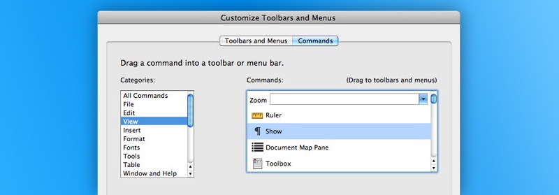
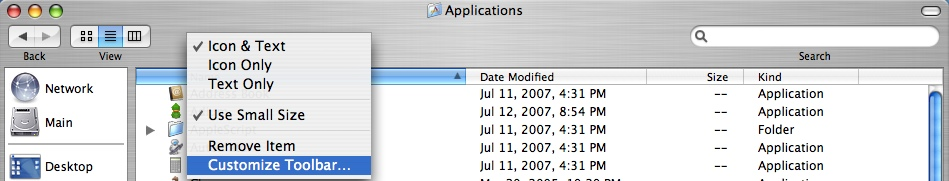

Since the early days of <abbr title="Graphical User Interface">GUI</abbr>
desktop computing, customizable user interfaces have been a staple in
productivity software across all major platforms. Dedicated users often spend
hours on end swapping panel configurations and rearranging toolbars and buttons.
Arguably, the heterogenous nature of user expectations raises the challenge of
designing an interface that works for everybody. But is customization the only
viable answer?

A customizable interface is one that gives the user partial or total control
over one or several of its properties. For years, Microsoft Word has allowed
users to customize the default toolbar under the assumption that this would help
them tailor the interface to fit their unique workflows.

 _Word 2011 customization panel._

Similarly, Mac OS 10.0 has introduced customizable toolbars in some of its
flagship applications. Icons can be selectively displayed, rearranged, or
completely discarded in favor of text-only labels.

 _Finder customizable toolbar_

Other notable software vendors such as Macromedia and Adobe have pushed for
customization in their interfaces, propelling it to a de facto standard in
modern application design over the years.

Since the dawn of graphical user interfaces, academics have thoroughly studied
subjectivity and efficiency in interface design ([Tullis], 1984). Most findings
boil down to the following conclusion: _interfaces that accommodate subjectivity
do not maximize efficiency_.

This may sound incompatible with the mantra that customization leads to more
productivity, but not if you consider the following angles:

* Most users are not aware of what works best for them. Their personalization
  choices are more often than not based on tastes and vague assumptions.

* Learning the customization features and exploring all the possibilities before
  making a choice will most likely distract users from the task at hand.

* Customizable interfaces add an extra layer of complexity that may turn off
  less experienced users. For instance, complaints of "disappearing" toolbar
  buttons are not hard to come by in less computer-savvy circles.

* The efficiency of customizable interfaces may be difficult to assess using
  quantitative methods.

In some particular circumstances, giving users control over some elements of the
interface is inevitable. But in the majority of cases, customization should be
kept to a bare minimum; it's the role of product designers to figure out what
works best for the majority of their users. A highly customizable interface is a
clear symptom of indecisiveness and lack of understanding.

A relevant and timely example would be distraction-free writing environments on
Mac OS X. Using minimalistic, barely customizable interfaces, this niche
category of applications tries to address the problem of feature creep that most
modern word processing solutions suffer from. Ironically, most of these
application developers fail to realize that even the slightest level of
customization can undermine their selling point. Distraction slowly creeps in
when users are given the ability to customize fonts, colors, and backgrounds.

The recently released iA Writer for Mac trod the path of *zero customizability*
in a bold move that goes against this trend. Unsurprisingly, it takes only a
couple of minutes on iA Writer to realize that the lack of customization is
nowhere near detrimental to efficiency. From typography to colors, everything
has been taken care of for users, allowing them to fully concentrate on the task
at hand: writing.

The one-size-fits-all approach could be easily dismissed as limiting for more
complex software products such as graphic editors and word processors. Their
thoroughly customizable interfaces are built on the premise that users have
different expectations and disparate workflows. Then again, one can wonder if
these monolithic, can-do-it-all applications are the right answer to
productivity and efficiency.

[Tullis]: http://scholarship.rice.edu/handle/1911/15866
