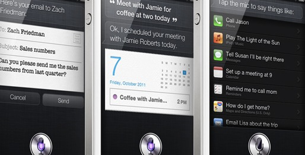

Amidst all the excitement around
[Siri](http://www.apple.com/iphone/features/siri.html), I came across an
interesting article[^1] from the 90's, where Mark Weiser, ex-principal scientist
at Xerox PARC, voices his skepticism about intelligent agents. His main argument
is that computers are first and foremost tools, and as such, should not be the
center of attention.

> Eyeglasses are a good tool---you look at the world, not the eyeglasses. […]
> Unfortunately, our common metaphors for computer interactions lead us away
> from the invisible tool, and towards making the tool the center of attention.

He argues that voice-based digital assistants such as Siri should not be
designed to behave like human beings, just as airplanes are not designed to fly
like birds. He goes on to explain that they are often portrayed in
science-fiction as prominent and attention-grabbing, which makes them inherently
bad tools:

> A computer that I must talk to, give commands to, or have a relationship with,
> is a computer that is too much the center of attention.

 _Siri on iOS 6_

I've given this some thought, and I agree that good interfaces should not
compete for user attention. But then, the computer he imagined talking to is
certainly not one you can fit in your pocket. From that angle, we are by all
means moving one step closer to invisible computers.

[^1]: Perspectives. [Interactions](http://dl.acm.org/citation.cfm?id=174800)
    issue 1 (January 1994)
