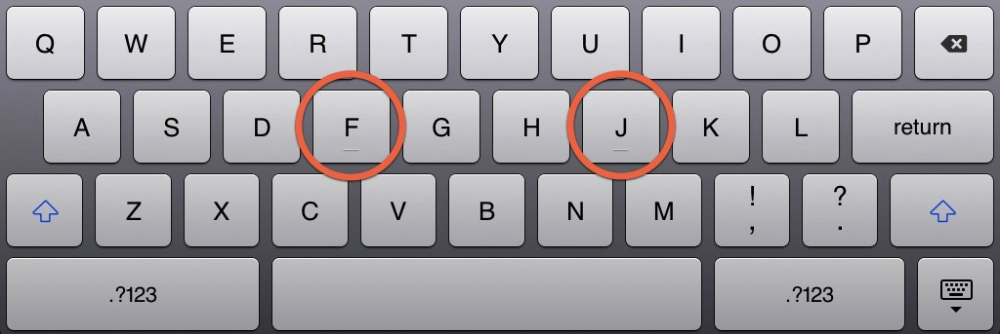
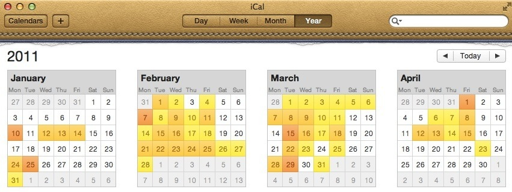
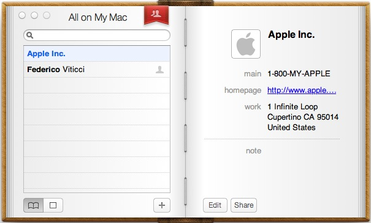

Skeuomorphs in UI design refer to interface elements that retain obsolete visual
or behavioral aspects of the physical objects they are based on. For instance,
the visual bumps in the `F` and `J` keys on the iPad virtual keyboard serve no
functional purpose; They are mere artifacts of physical keyboards where similar
indentations help provide sensory feedback to touch-typists.

 _The iPad keyboard on iOS 6._

Skeuomorphism is [not new](http://hallofshame.gp.co.at/qtimeno.htm) at Apple;
They have, on multiple occasions, shipped user interfaces that heavily borrowed
from the physical objects they are based on. The most recent episode involves
the redesigned iCal and Address Book in Lion, sporting a new skeuomorphic look
similar to their iPad counterparts---Calendar and Contacts.

 _iCal interface in OS X Lion_

The iOS-inspired interface came under harsh criticism, dismissed as an
[unnecessary
gimmick](http://www.macworld.com/article/161026/2011/07/osx_lion_review.htm) and
mocked for being [hideous](http://kensegall.com/2011/07/lions-little-lapse/) and
[infantile](https://web.archive.org/web/20110712034954/http://cushley.net/2011/07/in-depth-os-x-lion-review-part-3-new-visual-changes/).
While these reactions might be disproportionate, they are not completely
unfounded, as skeuomorphs come with their fair share of drawbacks:

- _False affordance_ leads users to expect the skeuomorph to mimic the behavior
  of the original object in a particular situation. Failure to meet these
  expectations often results in frustration and discomfort. For instance, the
  user might expect to be able to browse contacts by flipping the pages in the
  new Address Book app, even though such interaction wasn't implemented.

- _Visual noise_ distracts users and negatively affect their productivity.
  Skeuomorphs are greedy for both screen real-estate and users' attention, on
  the expense of efficiency and usability. The stitches in the iCal navigation
  bar illustrate this point.

- _Functional limitations_ dictated by the original object may severely harm the
  user experience. The lack of a convenient three-pane view in the new Address
  Book is a perfect example.

- _Disorienting_ users as a result of using an alien language that does not take
  advantage of the experience acquired through prior interactions with standard
  interfaces.

- _Alienating_ users with an excessive emphasis on aesthetics.

 _Address Book in OS X Lion_

When all is said and done, skeuomorphic interfaces come with some perks. Their
playfulness may have a more powerful _emotional impact_ on users; a contact
management app that looks like an actual address book has more chances of
establishing an emotional bond with its users and engaging them on the long run.
Its distinctive personality might not always favor productivity, but that would
be perfectly okay for the average user. The very tone of Apple's marketing is
primarily emotional, and the skeuomorphic interfaces on both on iOS and on OS X
perfectly serve their agenda.
