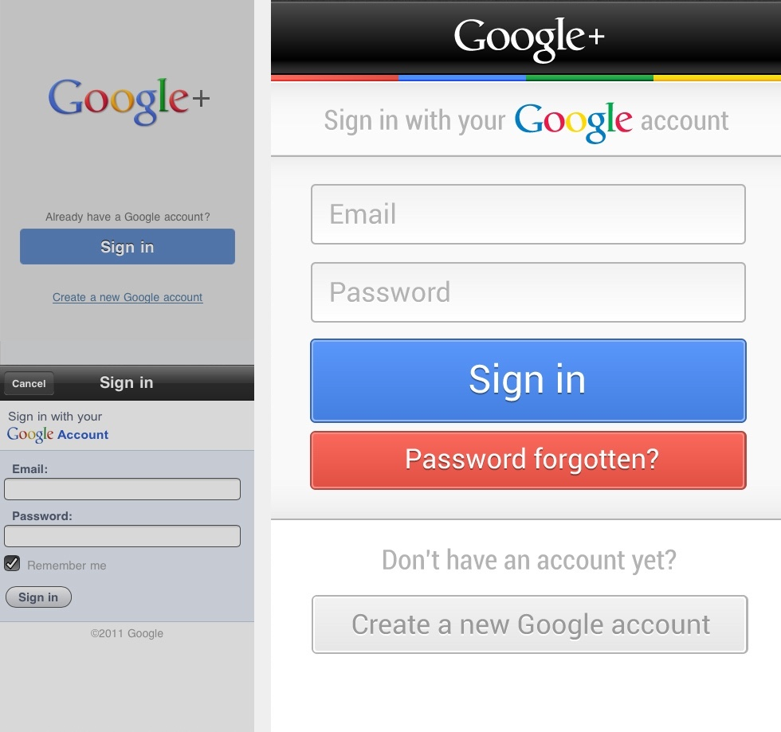
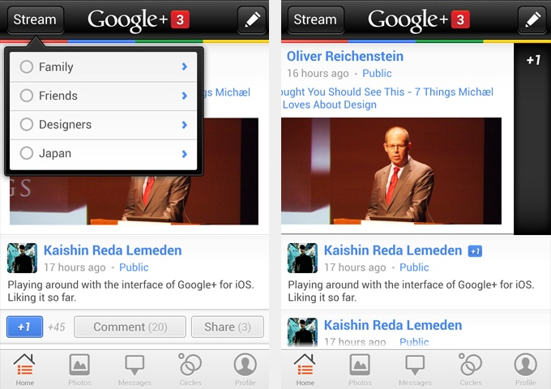

As of this writing, Google seems to be the only company that can challenge
Facebook in the social space. They understood that good interactions and
streamlined privacy controls can drastically improve the user experience on a
social network.

Having said that, the Google+ app on iOS is falling short of the standards set
by its Web counterpart. The app is a mishmash of Web views, experimental touch
interactions, and unpolished graphics. The result is a sub-par user experience.

### Signing In

To start off, users have to go through two completely useless screens to get to
the sign-in form. In order to create an account, you have to hunt down a blue
underlined link in the second screen, only to be taken to a poorly designed Web
form. One solution would be greeting users with the actual sign-in form as
mocked below:

 _An improved sign-in screen for
Google+ on iOS._

### The Stream

Dashboard navigation on mobile apps is as hacky as a design pattern can get,
especially when a tab bar can perfectly fit the bill. As for the default tab, it
would be safe to assume that users will be spending most of their time on the
stream. The mockup below shows how a native tab navigation could save users a
few taps and leverage what they already learnt on iOS.

 _An improved navigation
for Google+ on iOS._

Notifications would appear next to the logo in the navigation bar, making them
hard to miss regardless of where you are. Content should be given more
prominence by using the full-width of the screen. Ideally, raw URLs should be
hidden as long as the actual content of the link is displayed inline.

### Touch Interactions

Buttons might be a hack, but it'd be safe to assume that users won't be
switching streams often enough to justify gesture-driven navigation. Instead,
touch gestures should be used to perform the frequent action of plus-one-ing
posts. A popover would be a perfectly scalable design pattern to handle circle
switching. Other post-specific actions such as commenting or sharing would be
revealed by single-tapping the post cell itself---a pattern that was
battle-tested by Tweetbot.

 _Circle-switching and post
actions._

While these concepts are in no way a panacea for the current interface
shortcomings, they could be a very good start if Google decides to get more
serious about its fledgling social network.
