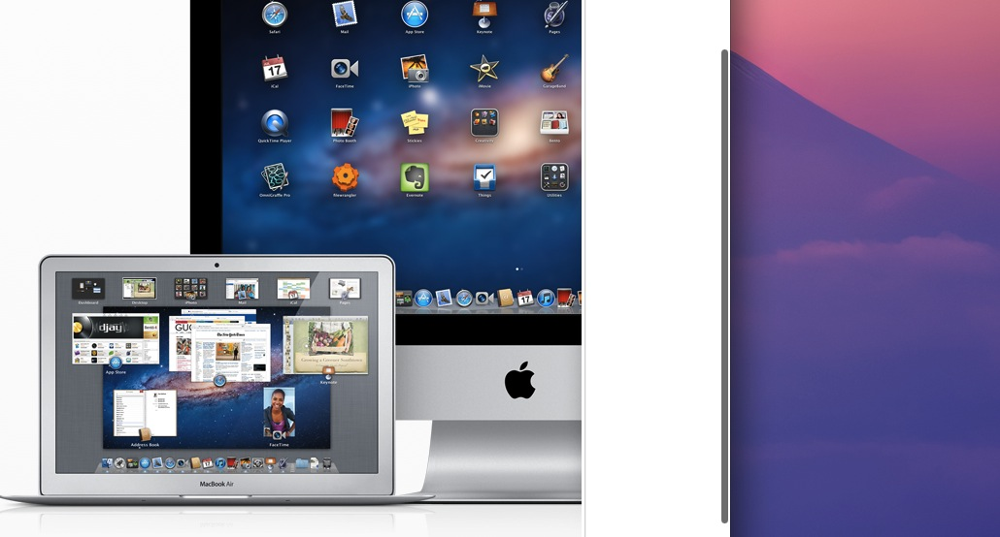

Since the release of OS X Lion last July, the appearance and usability of the
new scrollbars came under sharp criticism. Apple took a page straight out of the
iOS book; a move that didn't sit right with some OS X old-timers.

 _Scrollbars in Lion_

Scrollbars are _controls_ that transform user input into vertical or horizontal
content movement. They also happen to visually inform users about the position
of the visible area and how much of the overall content it represents. In his
lengthy Lion
[review](http://arstechnica.com/apple/2011/07/mac-os-x-10-7/3/#scroll-bars),
Siracusa argues that Apple had to sacrifice the convenience of constantly
displaying the foregoing visual cues for the sake of simplifying the interface
and saving screen real estate.

Like many design decisions, Apple had to make a compromise. Their decision seem
to be based on the premise that, in most cases, the scrollbars are not likely to
be in the user's [locus of
attention](http://www.usabilityfirst.com/glossary/locus-of-attention/)[^1].
Using screen real-estate to display non-critical information is nothing short of
a hindrance and is against the [progressive
disclosure](http://en.wikipedia.org/wiki/Progressive_disclosure ) principle. The
view provides immediate feedback when the user initiates a scroll, giving them
thereby the right information at the right time.

Users who relied heavily on scrollbars in Snow Leopard might be disoriented at
first, and will need some time to get used to this change. This setback is a
small price to pay if you ask me.

[^1]: Raskin, 2000.
