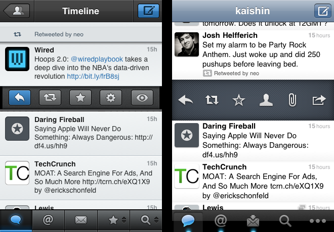
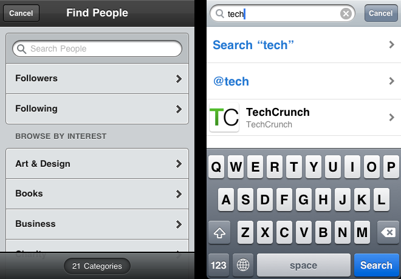
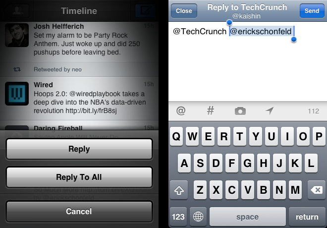
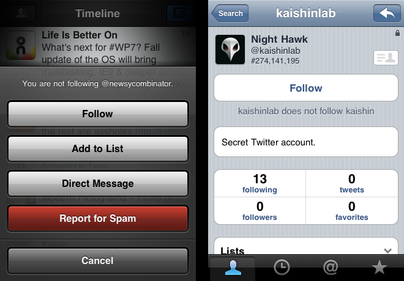

In the thick of the controversy surrounding Twitter's new third party
restrictions, [Tweetbot]---the long-awaited Twitter client from Tapbots---is
finally out for iPhone and iPod Touch. The overwhelmingly positive feedback is a
clear sign that the app met and even exceeded expectations.

To find out whether Tweetbot is a legitimate contender, I decided to pit it
against the official client using a <abbr title="Goals, Operators, Methods, and
Selection rules">GOMS</abbr>-inspired, oversimplified [human information
processing model][HIP] on a set of tasks performed by the average user on
Twitter.

 _Tweet options displayed after a single
tap._

### The Rules

Before starting this exercise, let's go over some of the concepts that will be
used throughout the article:

* _An interaction_ is any point of contact between the user and the interface,
  such as a tap or a swipe. Each interaction is assigned a value based on the
  time required to execute it. For the sake of simplicity, a _single tap_ is
  given a nominal value of `1` and used as a base unit for other interactions.

* _A task_ is any set of actions sharing the same end goal. There may be one or
  more set of interactions to carry out the same task. The time required to
  achieve a given task is considered to be equal to the sum of the individual
  values of each interaction involved. The lower the sum, the more efficient the
  interface.

* Unless stated otherwise, typing time was zeroed out.

* When two or more methods of achieving a given task are possible, only the most
  efficient one is used in the comparison. The impact on the overall workflow is
  also taken into account.

* Only the default behavior of the triple tap is taken into consideration for
  Tweetbot.

The values assigned to each interaction are as follows:

| Interaction | Value
|-|:-:|
| Tap | 1
| Double tap | 1.5 |
| Swipe | 1.5 |
| Triple tap | 2 |
| Long tap | 2 |

Thinking time was assigned a value of `0.5`, and will be referred to as MOP
(multi-option prompt) in the tests. To keep things simple, the number of options
was not taken into account, nor was the habit factor.

### Round 1: Basic Tasks

We'll start by having a look at how efficiently the two clients handle basic
tasks such as tweeting and replying:

| Task | Tweetbot | Twitter
|-|:-:|:-:|
| Send a Tweet&sup1;  | 2 | 2 |
| Reply&sup1; &sup2;   | 3 | 4 |
| Retweet (native) | 4 | 4.5 |
| Send a new DM&sup3; | 6.5 | 5.5 |
| Open a link | 1.5 | 2 |

1. No hashtags or @ signs.
2. No other users mentioned in the original tweet
3. The tap to get to the Messages view is zeroed out

**Outcome:** draw.

The two clients are equally efficient when it comes to tweeting and retweeting.
Tweetbot cleverly handles single replies and links thanks to double and triple
taps, while the official client makes sending a new direct message significantly
less cumbersome.

 _Sending a direct message._

### Round 2: Hashtags, Mentions, and Group Replies

Let's now spice up the comparison with some hashtags and @ mentions:

| Task | Tweetbot | Twitter
|-|:-:|:-:|
| Compose a tweet with # and @ | 7 | 4 |
| Compose a tweet with 3 # and 2 @ | 15 | 7 |
| View conversations&sup1; | 1.5 | 2 |
| Reply all (<abbr title="Multi-Mention Tweet">MMT</abbr>)&sup2; | 4.5 | 5 |
| Reply single (<abbr title="Multi-Mention Tweet">MMT</abbr>)&sup2; | 4.5 | 4 |

1. Where the user takes part
2. Multi-mention tweet

**Outcome:** Twitter for iPhone wins.

Thanks to shortcuts, the official Twitter client outclasses Tweetbot when it
comes to composing tweets containing hashtags and @ symbols. In theory, the two
clients handle multi-mention replies with almost equal efficiency. In practice,
Twitter's less intrusive solution gives it the upper hand.

 _Replying a tweet with multiple @ mentions._

### Round 3: User Actions & Lists

Now for the less frequent tasks:

| Task | Tweetbot | Twitter
|-|:-:|:-:|
| Follow / Unfollow | 3.5 | 5 |
| Report a user |5 | 8 |
| Translate a tweet | 4.5 | 5 |
| Favorite a tweet | 2.5 | 3 |
| Delete a tweet | 3.5 | 4 |
| Switch time-lines | 2.5 | 3 |

**Outcome:** Tweetbot wins.

The official client didn't stand a chance here; Tweetbot's long tap is a
godsend.

 _Following a user._

### Results

| Task | Tweetbot | Twitter
|-|:-:|:-:|
| Total | 71 | 68 |

The relatively awkward, albeit native, method of keying hashtags and @ mentions
in Tweetbot skews the results in favor of Twitter for iPhone. If it wasn't for
this detail, the third party client would have come out ahead.

When all is said and done, it would be short-sighted to pick a winner based on
the total score alone. In order to gauge the relevance of these tests, we need
to take a closer look at the way we use Twitter in reality. [Studies] suggest
that a big majority of users on the social platform are silent; unless you are a
news agency, a celebrity, or a spam bot, you are more likely to be reading
tweets than tweeting or sending DM's. As a result, the overall experience is
greatly affected by our passive use, a point that the tests above completely
eschewed in favor of purely active use scenarios.

Notably, Tweetbot shines in some areas that would be hard to assess using the
<abbr title="Human Information Processing">HIP</abbr> model above. Save for the
occasional tweet, reply, or DM, we spend most of the time on Twitter wading
through hundreds of tweets and swapping accounts and lists. Few Twitter clients
address these areas as elegantly as Tweetbot does:

* The number of new tweets (since the last refresh) is displayed in a
  unobtrusive blue bar in the timeline. This may seem gimmicky at first, but it
  turns out to be a huge time saver for timeline completionists.

* Single swiping a tweet displays related tweets in a dedicated conversation
  view, even if the user is not taking part in them. There seems to be no way to
  do that in the official client.

* Even though the visual style may not appeal to everyone, it provides a good
  balance of contrast between content and chrome.

For a 1.0 release, Tweetbot is doing a remarkable job, especially when
considering the saturated and volatile market of Twitter third party clients.
Even though there is still room for improvement in certain areas, Tweetbot for
iPhone has got what it takes to dethrone the official client, and then some.

In [round 2](https://redalemeden.com/blog/2012/twitter-ios-showdown-round-2), we
will introduce Twitterrific to the mix and revisit some of the tests introduced
above.

[HIP]: http://en.wikipedia.org/wiki/Human*information*processor*model
[studies]: http://labs.yahoo.com/publication/who-says-what-to-whom-on-twitter/
[tweetbot]: http://tapbots.com/software/tweetbot/
