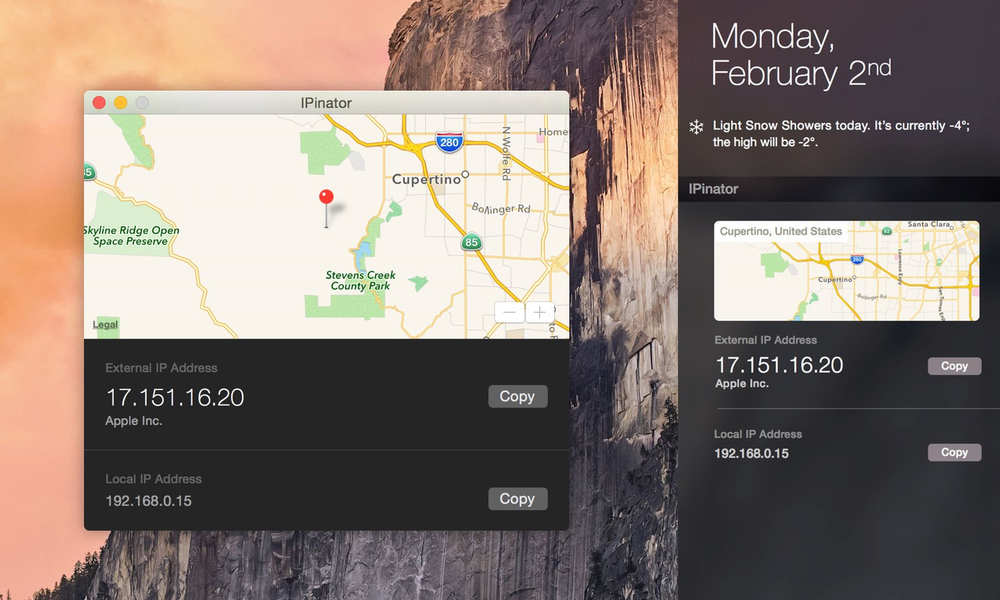

I'm pleased to announce that [IPinator](http://ipinator.kaishin.co) is *finally*
[live on the App Store](https://itunes.apple.com/us/app/ipinator/id959111981).
It's a utility app and Notification Center widget that displays your external IP
address and locates it on a map for easy access during local development, VPN
setup, etc.

 *Application window and
Notification Center extension.*

IPinator is written in Swift and uses [Argo](https://github.com/thoughtbot/Argo)
for JSON parsing and [Llamakit](https://github.com/LlamaKit/LlamaKit) for
`Result`. During development, I came across a limitation where Today extensions
can't display a `MKMapView` directly. I got around it by generating an `NSImage`
of the map and displaying it instead.

If you'd like to write about IPinator, feel free to [drop a
line](http://ipinator.kaishin.co/support) for a promo code.
