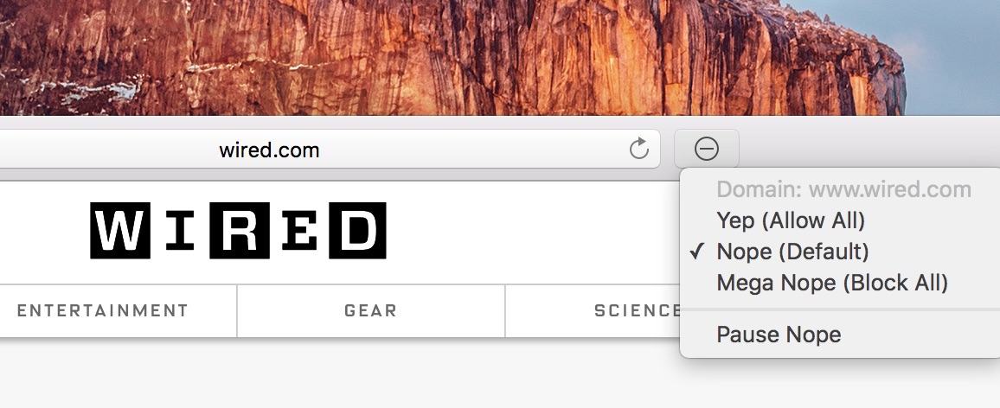

Two months ago I started working on [Nope](https://redalemeden.com/nope), a
content blocking extension for Safari 9. Today I am happy to launch [a stable
version](https://github.com/kaishin/Nope/releases/v1.2.0/) and get more people
to try it.

## Another Content Blocker?

There is no shortage of feature-packed ad blocking extensions such as
[AdBlock](https://getadblock.com), [Ghostery](https://www.ghostery.com), and
[Disconnect](https://disconnect.me/disconnect). But as effective as these can
be, they rely on JavaScript to identify and block resources, which has a
non-trivial performance cost as Benjamin Poulain
[outlines](https://webkit.org/blog/3476/content-blockers-first-look/) on the
WebKit blog:

> The reason we are unhappy about the JavaScript-based content blocking
> extensions is they have significant performance drawbacks. The current model
> uses a lot of energy, reducing battery life, and increases page load time by
> adding latency for each resource. Certain kinds of extensions also reduce the
> runtime performance of webpages. Sometimes, they can allocate tremendous
> amounts of memory, which goes against our efforts to reduce WebKit’s memory
> footprint.

The new content blocking extension
[APIs](https://developer.apple.com/library/prerelease/mac/documentation/Extensions/Conceptual/ContentBlockingRules/Introduction/Introduction.html)
in WebKit were designed to solve this very problem by compiling the rules into
an efficient byte-code format that executes for each request, eliminating the
need to run custom scripts code to determine what should be blocked and what
should not.

After trying out the [new batch](https://beta-extensions.apple.com/?q=block) of
content blocking extensions in the hope of finding a replacement for
[AdBlock](https://getadblock.com), I decided to take matters into my own hands
and start from scratch with an increased focus on
[performance](https://webkit.org/blog/4062/targeting-domains-with-content-blockers/)
and privacy.

## How it Works

Once Nope is enabled, every website you visit will fall into one of these three
categories:

- *Yep*: Nothing is blocked.
- *Nope*: Third party resources belonging to any of the enabled categories (ads,
  tracking, social) are blocked. This is the default behavior.
- *Mega Nope*: All third party resources are blocked, regardless of whether they
  are on the rules list or not.

You can view a list of all the (sub)domains that you've already categorized in
the settings accessible from  *Safari > Preferences > Extensions > Nope*. It's
also possible to manually edit the comma-separated list to add new (sub)domains
or remove existing ones.

 *You can set the behavior for a
specific domain or subdomain using the toolbar button.*

## API Limitations

Currently the content blocking APIs don't expose the blocked resources to the
extension. This means that there is no way of displaying what has been blocked
outside of the *Console* logs in the developer console---not a great user
experience for the average user.

Those who are happy to make this---hopefully temporary---tradeoff will see
improved Safari performance, especially on sites that load dozens of third party
scripts.

 *Logging blocked
resources in the Safari Developer Console.*

## Roadmap

One of the goals that motivated me to work on Nope is to make an open-source
blocking database that anyone can contribute to. Since the initial database I
scrapped together ended up breaking a large number of popular sites, I opted for
the open-source [Disconnect database](https://github.com/disconnectme/disconnect-tracking-protection)
to get things off the ground more quickly. Going forward, I would like to drop this
dependency and move the rules to a separate repository for more flexibility and
transparency.

So, how about you give [Nope](https://redalemeden.com/nope) a try and let me
know what you think by opening issues or pull-requests on [the repository](https://github.com/kaishin/Nope)?
