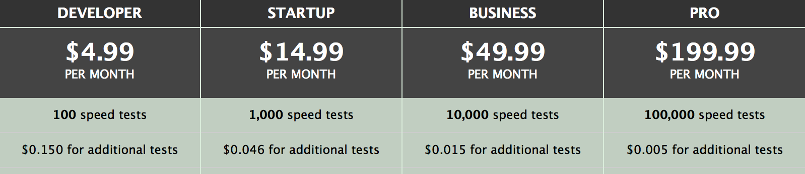

Last year, I set to build an Internet speed testing app for OS X. Between a
full-time job and summer vacations, it took me about 6 months to wrap up a 1.0
using the [SpeedOfMe](http://speedof.me) free-while-in-beta API.
[Speedster](https://speedsterapp.com) was born.

Speed tests are a tricky business. I wasn't convinced that the app would work
for everyone, so I made it free. I also capped the number of daily tests per
user to not get my API key revoked, and added an in-app purchase to remove that limitation
for good measure.

Shortly after submitting 1.0 for review, the app was rejected for violating
section 2.9 of the review guidelines:

> 2.9 Apps that are "demo", "trial", or "test" versions will be rejected. Beta
> Apps may only be submitted through TestFlight and must follow the TestFlight
> guidelines

It seems like I wasn't the only one sailing uncharted waters here. After a
couple of back and forth, the app went live on February 1st. Here are some
relevant numbers from the first month:

- *Downloads:* 14k.
- *IAP:* 212 units.
- *Revenue:* $620.
- *API usage*: 20k requests.
- *Conversion:* 1.5%.

Most of the revenue was generated during the first 2 weeks as the weekly average
dropped from $285 to $23 by the end of the month.

On February 20th, I woke up to an email from SpeedOfMe announcing their pricing
plans and prompting me to update my billing information.

 *SpeedOfMe API plans.*

Uh-oh.

Going with the Pro plan as the only reasonable option, I projected cumulative
revenue and costs for the next 12 months, as they taught me in business school:

![[Chart] Cumulative Revenue Projection](./cumulative-costs-sales.svg)
*Projected cumulative revenue/costs (purple/orange).*

This did not bode well. Even an optimistic revenue projection wasn't enough to
offset the costs for more than 3 months. Without recurring revenue, Speedster
would not be sustainable on the long run.

After 24 hours of hesitation, I pulled the trigger on the *Speedster Hero* IAP
and replaced it with consumable tests packs in 1.1. Here's how things went
since:

![[Chart] Daily Sales](./march-may-sales.svg) *Daily revenue between March 1st
and May 12th. Total: $148.*

Oops. Consumables aren't popular outside of games for a reason. The app made a
measly $148 since March 1st and the pricing tweaks I did in the course of the
last two months did not move the needle.

Remember that projection graph from earlier? Now it looks like this:

![[Chart] Readjusted Cumulative Revenue/Cost Projection](./sales-adjusted-cumulative-costs-sales.svg) *Readjusted cumulative
revenue and costs projection (purple and orange respectively).*

Did these changes make things worse? Absolutely. Do I have a clue why? Maybe.
Let's look at some ★☆☆☆☆ reviews:

> I would stay away from this. Says free but its more like test three times and
> you must buy it. --- Jatilq no ping and 3x per day? --- Ojaste Why pay for a
> speed test when there are dozens of websites that provide this for free? limit
> the free version to 3 daily tests? $4 for unlimited? I will use speedtest.net
> for free --- Legatony

The list goes on, but I will stop here. The gist of it is that the vast majority
of users do not see enough value to justify paying for a consumable IAP.

With downloads hovering around a weekly average of 600, the prospects of a surge
in revenue are bleak. Something's gotta give.

![[Chart] Weekly Downloads](./weekly-downloads.svg) *Weekly downloads. Total as of
May 12th: 21442.*

In my last attempt to make this work, I am introducing some breaking changes in
2.0. Here's an outline:

- The app will no longer be free.
- Users will be prompted to use their own SpeedOfMe API keys.
- Existing *Hero* customers will be grand-fathered until further notice.
- Test packs will remain as a secondary option for those who don't want to
  manage their own API keys.

Will these changes net me a few more ★☆☆☆☆ reviews? I betcha. But at this point
that is the least of my concerns.

*To be continued*.
