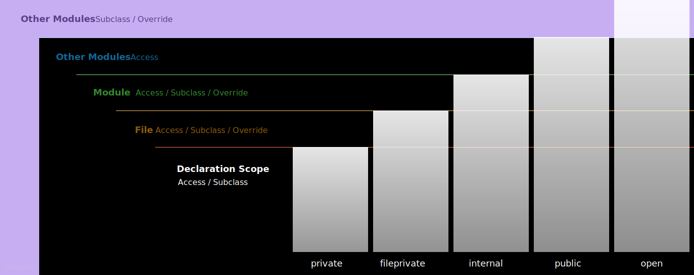

Swift 3 introduced finer-grained control over what can access what in your code.
The addition of 2 keywords made things less obvious, however. Here is a
cheatsheet to help with the transition:

- **Private**: Entity can only be accessed within the same scope it was defined
  in. A `private` class can only be subclassed by another `private` class
  defined in the same scope.

- **File private**: Entity can only be accessed within the same file. You can
  subclass `fileprivate` classes and override their `fileprivate` methods and
  properties.

- **Internal**: Entity can only be accessed within the same module, i.e. app or
  framework target. This is the *default* if no access keyword is specified. You
  can subclass classes and override their non-private methods and properties.

- **Public**: Entity can be accessed from within other modules. Classes cannot
  be subclassed.

- **Open**: Entity can be accessed from within other modules. Classes can be
  subclassed in other modules if they are marked as `open`. Each method and
  property needs to be marked as `open` to be overridable in subclasses.
