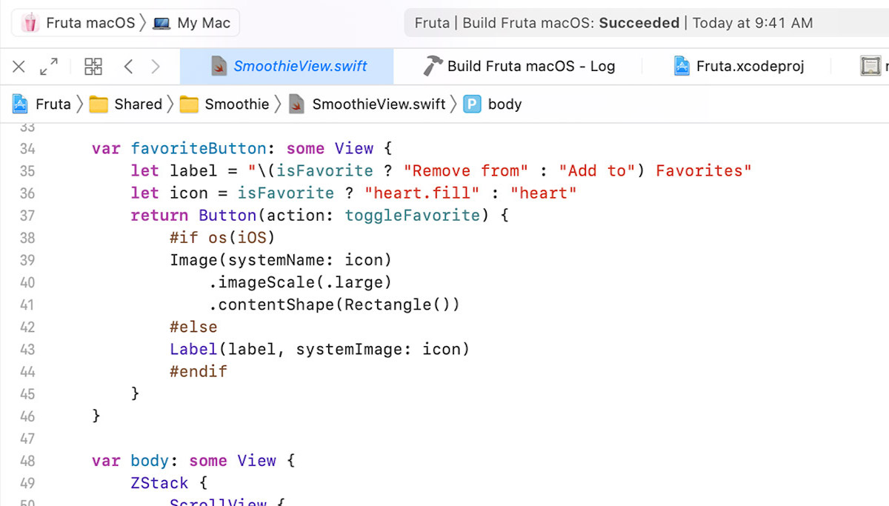

The new _document tabs_ in Xcode 12 caught me off-guard more than once at first,
but as soon as I figured out how they work, I started to enjoy using them.

For instance, in server-side projects I am typically dealing with half a dozen
files related to the same area or feature; the model itself, the repository,
migrations, tests, mocks, etc. Before, I used separate window tabs for each
"topic", but now I rely heavily on document tabs to fill that need. My current
setup is something roughly like this:

- I usually keep 3 window tabs in every project: _development_, _testing_, and
  _debugging_. I occasionally create break-out window tabs for self-contained
  tasks like refactoring, reading the source code of a dependency, etc.

- In the development window tab, I use vertical area splits for the different
  topics I am actively working on. Usually these correspond to a model file and
  its satellite types. I start with one then add or remove splits as needed.

- Inside each area, I use the new _document tabs_ to keep all the related files
  open, enabling quick tab switching using the keyboard shortcut <kbd>cmd</kbd> + <kbd>shift</kbd> + <kbd>[</kbd> or <kbd>]</kbd>.

- I use horizontal splits when I need to look at different files in the same
  topic. An example would be the model and its migration file in server-side, or
  a view and its state object in SwiftUI.

I reason better about code when I can see several related files at the same
time, and document tabs give me an even more effective way to achieve that.
