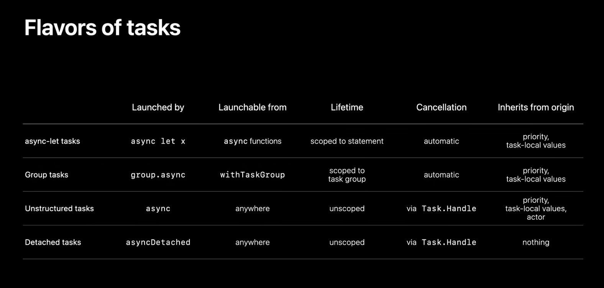

WWDC is finally here! Since I won't manage to post daily notes this year, I
thought I'd jot down the sessions I watched along with a key takeaway for each.
The sessions below are listed in the order I have watched them:

- [What’s New in SwiftUI](https://developer.apple.com/wwdc21/10192): I'm really
  excited about the new modifiers for list, which felt a bit abandoned last
  year. I hope later betas introduce some APIs to read the content offset of
  `ScrollView`; I need this frequently and I am not happy with the current
  workarounds.

- [What’s new in Foundation](https://developer.apple.com/wwdc21/10109): The new
  attributed string and formatter APIs are simply brilliant. Kudos.

- [Add rich graphics to your SwiftUI app](https://developer.apple.com/wwdc21/10021): While I sort of expected the
  addition of  `Material`, `Canvas` caught me off-guard and I am loving it. 😍

- [Meet DocC Documentation in Xcode](https://developer.apple.com/wwdc21/10166):
  Hands-down my favorite new surprise announcement this year. Lots of neat
  little details—such as autocomplete symbol links for cross-referencing—and the
  project is slated to go open-source later this year! 💪

- [What's new in Swift](https://developer.apple.com/wwdc21/10192): Really loved
  this session, especially the shoutouts to various efforts from Swift community
  members.

- [Meet async/await in Swift](https://developer.apple.com/wwdc21/10132): Great
  starting point to get familiar with async/await and what they bring to the
  table.

- [Meet StoreKit 2](https://developer.apple.com/wwdc21/10114): I have no idea
  why I picked up this session, but I don't regret it! Great to see async/await
  being already used in the SDK this prominently.

- [Apple’s privacy pillars in focus](https://developer.apple.com/wwdc21/10085):
  The deeper dive into how private relay works in iCloud+ was quite fascinating.

- [Craft search experiences in
  SwiftUI](https://developer.apple.com/wwdc21/10176): Pretty impressive how
  little code is needed to achieve a platform-native search experience on all
  Apple platforms. If this is the future of the framework, sign me up!

- [Demystify SwiftUI](https://developer.apple.com/wwdc21/10022): Really
  informative session about SwiftUI view identity and lifetime. It also
  introduces new terminology—such as "inert modifier"—that will come in handy
  when discussing these topics.

- [Meet AsyncSequence](https://developer.apple.com/wwdc21/10058): A short and
  sweet session about `AsyncSequence`. I was wondering how this fits with
  Combine, especially given the lack of updates on that front, but unfortunately
  this didn't shed any light on that.

- [Explore structured concurrency in
  Swift](https://developer.apple.com/wwdc21/10134): This session had my favorite
  slide in the conference so far in terms of information density.

- [Meet Xcode Cloud](https://developer.apple.com/wwdc21/10267): Built-in
  continuous integration in Xcode is long overdue, and I am eager to try this
  out.

- [Protect mutable state with Swift actors - WWDC 2021 - Videos - Apple
  Developer](https://developer.apple.com/wwdc21/10133): At this point it's
  probably clear that concurrency is topping my list of interests this year.
  This one focuses on _actors_, which make working with synchronized data access
  much easier.

- [Meet Shortcuts for macOS](https://developer.apple.com/wwdc21/10232) I am
  really impressed but the amount of work that went into introducing Shortcuts
  for macOS.It even comes with a <abbr title="Command Line Interface">CLI</abbr>
  for more integration flexibility.

- [Host and automate your DocC
  Documentation](https://developer.apple.com/wwdc21/10236) I have yet to give
  this a try, but my first impression is that it’s more work than I expected to
  deploy this remotely.

- [What's new in Mac Catalyst](https://developer.apple.com/wwdc21/10052) I
  stopped midway because I realized most of it is not immediately useful for me.

- [Swift concurrency: behind the
  scenes](https://developer.apple.com/wwdc21/10254) This was probably my
  favorite concurrency session so far. Visual timelines are decidedly the only
  way for me to understand how concurrency primitives work.

- [Streamline your localized strings](https://developer.apple.com/wwdc21/10221)
  Some pretty handy new additions to various localization workflows. The
  translation visual editor is nifty too.

- [Discover concurrency in SwiftUI](https://developer.apple.com/wwdc21/10019)
  Nice quality of life improvements when using published properties, but this
  session left me wondering how Combine and the new concurrency tools will
  coexist in SwiftUI, if at all.

With WWDC officially over, there is still a ton I am planning to go over in the
coming weeks, including SF symbols, widgets, and watchOS additions among others.
