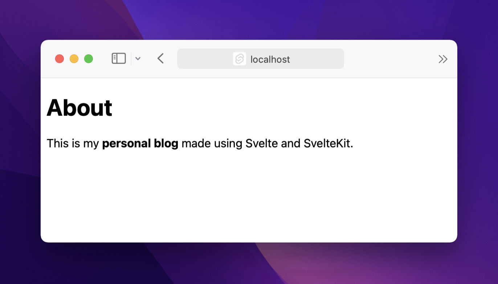
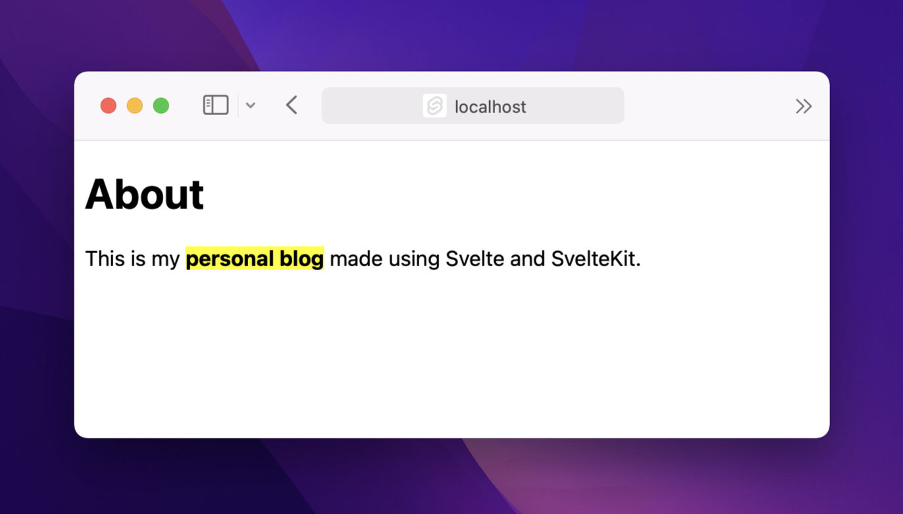

For the first post of 2022, let's build a static site using Svelte. I previously
shared my [first impressions](https://redalemeden.com/blog/2021/picking-up-svelte) picking up
SvelteKit. Since then, I managed to get closer to a workable static site setup,
and today I'd like to share some of my learnings.

We will continue from where we left off in the previous entry
([commit](https://github.com/kaishin/svelte-starter/commit/e108b31282d128e79743b3d2abbad9a27224d6e0)).
For starters, writing plain HTML is no fun—I know exactly one person who still
does that, and I wish them all the best in the world. But that’s not something I
would let my friends do. Markdown is much nicer, so my first attempt was to find
a JavaScript markdown parser (like
[markdown-it](https://github.com/markdown-it/markdown-it)), add it to the
project, then write some bundler logic to transform any `.md` file into HTML.

But that’s too much hassle; I’ve been too spoiled by [mdx.js](https://mdxjs.com)
in React-land, and I wanted to find something similar for Svelte. It didn’t take
me long to come across exactly what I was looking for:
[mdsvex](https://mdsvex.com).

I know, naming things in the JS ecosystem got quite out of hand, but both of
these libraries allow you to write markdown alongside scripts, components, and
other modern JS goodies. On paper this would upset every purist I know—and I
know quite a lot of them!—but in practice it means I can start with plain
markdown and add inline interactive bits and pieces whenever I need to, without
having to rewrite the entire page in HTML first.

Let’s start by adding the *mdsvex* dependency. It might sound like an
antibiotic, but you can add it just like any other `npm` library!

```sh
pnpm add -D mdsvex # or equivalent in npm, yarn etc.
```

Notice that I added it as a dev dependency using the `-D` flag; that’s because
SvelteKit generates pages that don’t have any runtime dependencies, even when
they are dynamic.

Next, I created a new markdown file in `routes`, and called it `about.md`:

```md
# About
This is my personal blog made using Svelte and SvelteKit.
```

When I ran `pnpm run dev` command and navigated to `localhost:3000/about`, I got
this error:

```console
Error: Parse failure: Unexpected token (1:0)
Contents of line 1: # About
```

That’s because I don’t read documentation. Ok I usually do, but the `mdsvex`
website had no mention of `SvelteKit`. This kind of puzzle piece matching in the
front-end tooling ecosystem is pervasive, and some things never change.

I took a step back and read the Svelte CLI configuration
[reference](https://wmzy.github.io/svelte-cli/config/#global-cli-config), but
didn’t find any mention of file extensions. Then it dawned on me that SvelteKit
might have a completely different configuration syntax, which I confirmed by
searching for “extension” in the docs. And [there it
was](https://kit.svelte.dev/docs#configuration). A beginner’s mistake, but how
could I have known?

Back to the error. I added the `.md` extension to the config file,
`svelte.config.js`, then restarted the server.

```typescript
const config = {
  extensions: [".svelte", ".md"],
  // Consult https://github.com/sveltejs/svelte-preprocess
  // …
};
```

Visiting the `/about` page in the browser produced no error this time...but no
HTML either. The page shows `# About This is my personal blog made using Svelte
and SvelteKit.` as plain text. What gives?

*Few minutes later*...

Sparing you the painful details this time around, I realized that adding
`mdsvex` as a *processor* was required for the markdown to be properly parsed.
To do that I had to import it at the top of the config file:

```js
import { mdsvex } from "mdsvex";
```

Then add this bit:

```diff
extensions: [".svelte", ".md"],
// Consult https://github.com/sveltejs/svelte-preprocess
// for more information about preprocessors
+ preprocess: [preprocess({}), mdsvex({ extensions: [".md"]})],
```

This line tells SvelteKit to use the default preprocessor, but also `mdsvex` for
markdown files. Notice that `".md"` needs to be specified in both spots,
otherwise parsing would fail.

After restarting the server once more, our `/about` page is live in its full
HTML glory!



Thanks to SvelteKit’s file based routing, anything added to the `/routes` folder
ends up generating a stand-alone page. You can read more about SvelteKit routing
[here](https://kit.svelte.dev/docs#routing).

Since this is not strict markdown, we can have some fun! For instance we can add
styles that only apply to the *about* page.

```md
# About

This is my **personal blog** made using Svelte and SvelteKit.

<style>
  strong {
    background-color: yellow;
  }
</style>
```

And bam!



I don’t know about you, but I appreciate having the ability to break the mold,
so to speak, when I need to. You can find the changes above in this
[commit](https://github.com/kaishin/svelte-starter/commit/38ceedf4d5c6c0740a3d4479a1f9662bad7fe867).

Stay curious, stay safe!
