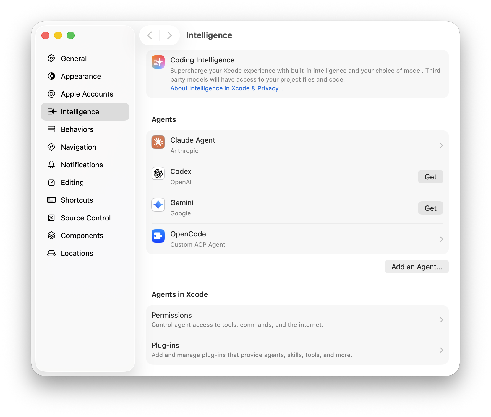
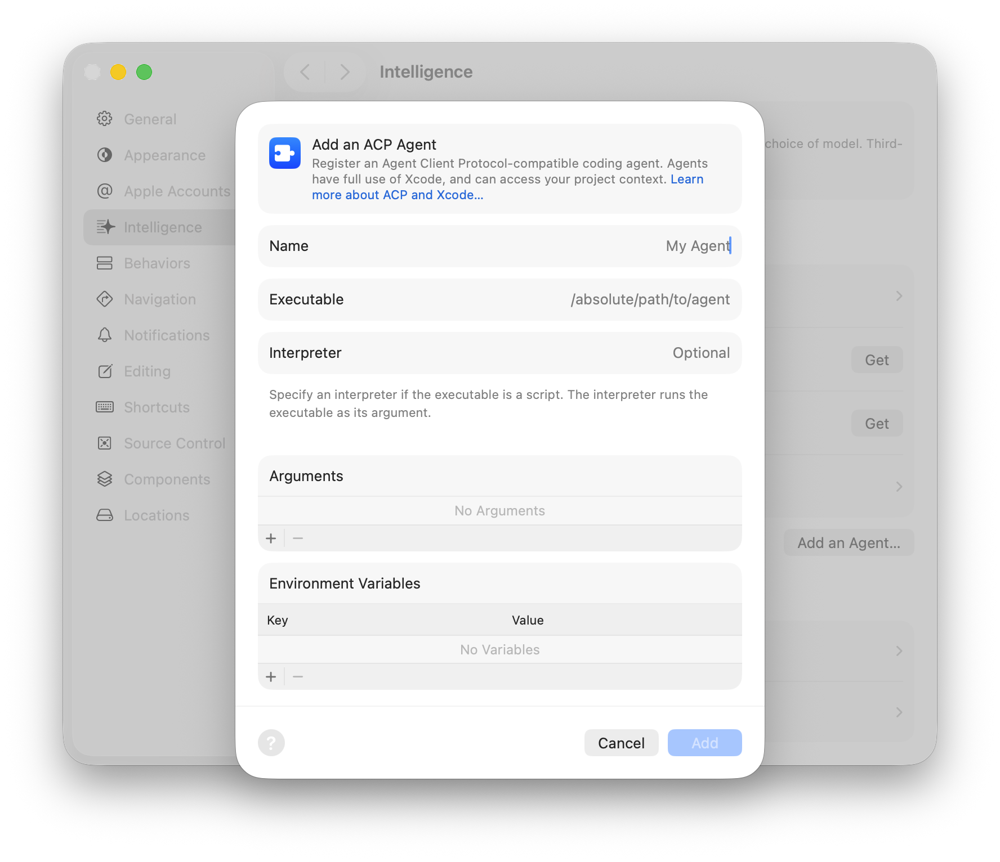
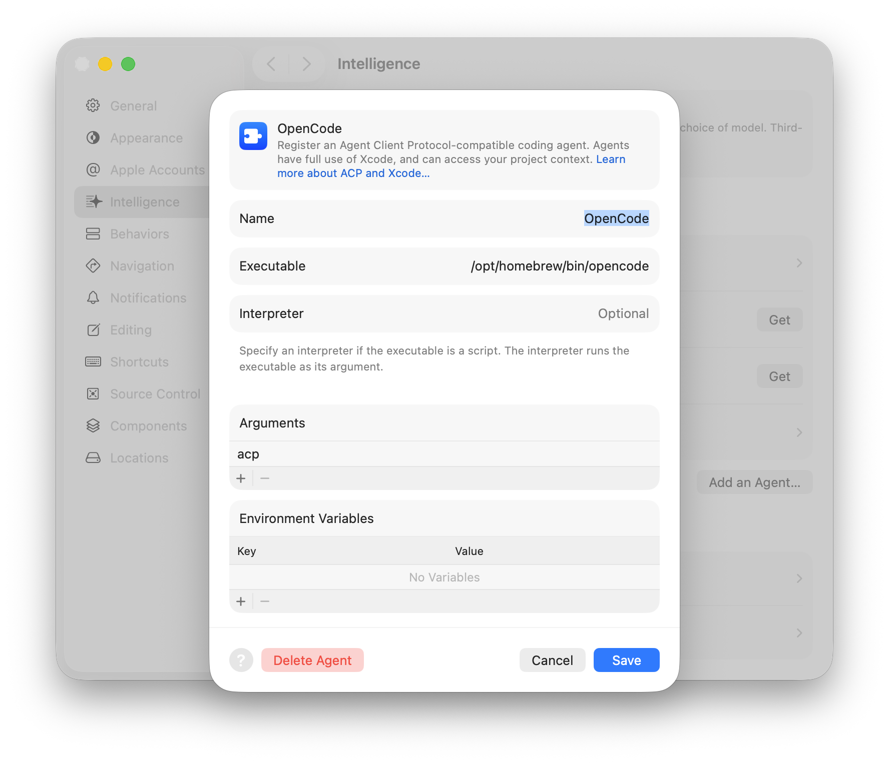
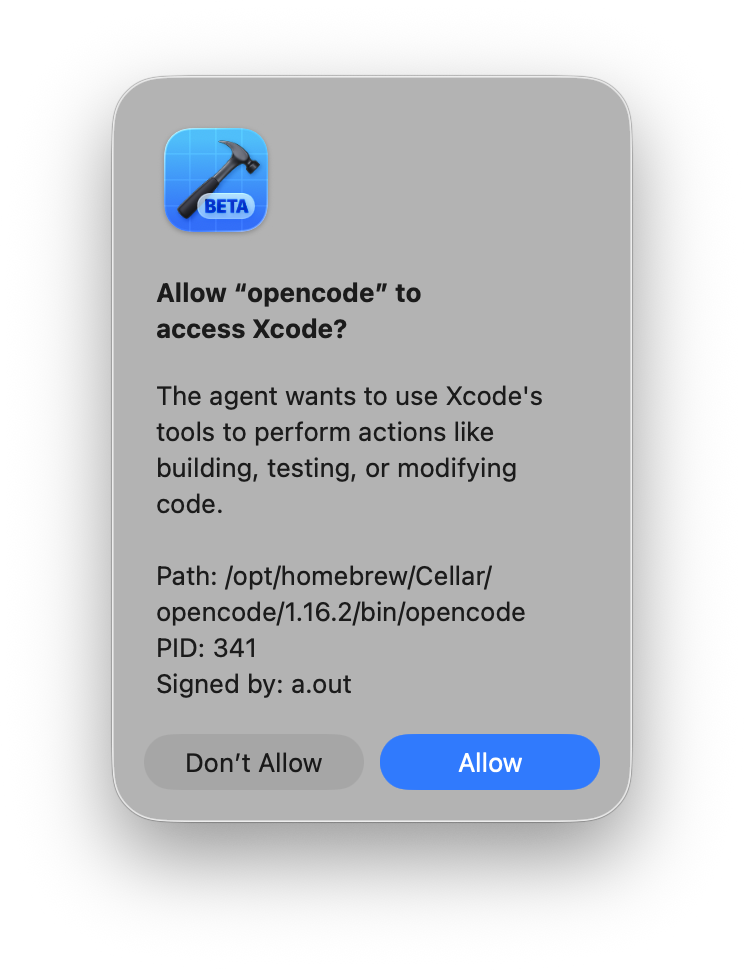
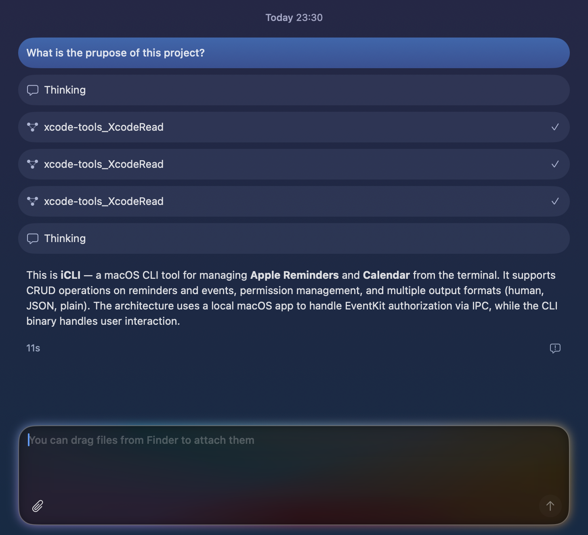

One of the most exciting announcements out of WWDC this year is support for third-party coding agents, or harnesses, in Xcode 27. Over the past couple of years, I've used a lot of GUIs and TUIs for coding agents, but the Xcode Intelligence team has knocked it out of the park with the UI and animations, so much so that I feel, for the first time, incentivized to use it.

Xcode 27 achieves this through first-class support for [ACP](https://agentclientprotocol.com/)-compatible coding harnesses[^1], which makes it possible to use any agent even if not officially supported by Apple. This guide uses OpenCode as an example, but the same steps apply to any ACP-compatible harness.

First, we need the path to the executable. For OpenCode installed via Homebrew, that's `/opt/homebrew/bin/opencode`. You can find it using the `which` command:

```sh
which opencode
```



In Xcode Settings, go to the _Intelligence_ tab and click _Add an Agent…_ in the _Agents_ section.



Fill in the _Name_ (anything goes) and _Executable_ fields. Leave _Interpreter_ blank unless the executable is a script.

Some agents require additional arguments to enter ACP mode. For OpenCode, add `acp` to the _Arguments_ list. See [Finding the Right Arguments](#finding-the-right-arguments) below if you're unsure what to put here.



Click _Add_. The first time Xcode launches the agent during that session, it will ask for permission. Click _Allow_.



That's it. The agent is now ready to use in Xcode. In the _Intelligence_ sidebar, click _New Conversation_ and select your freshly added harness from the dropdown.



## Finding the Right Arguments

Not all ACP-compatible harnesses need arguments, and many listen for ACP by default. Others, like OpenCode, require a subcommand to switch into protocol mode.

The [ACP registry](https://github.com/agentclientprotocol/registry) lists all compliant agents. Each entry's `agent.json` tells you exactly how to launch it. Here's OpenCode's:

```json
{
  "id": "opencode",
  "name": "OpenCode",
  "distribution": {
    "binary": {
      "darwin-aarch64": {
        "cmd": "./opencode",
        "args": ["acp"]
      }
    }
  }
}
```

Find your agent's folder in the registry and open `agent.json`. If there's an `args` field under your platform, add those values to the _Arguments_ list in Xcode, one per line. If there's no `args` field, leave it empty. Some agents are more finicky to set up than others, but the most popular ones are straightforward.

P.S. I still haven't figured out a way to change models, but I will update this guide if I do.

[^1]: A harness is a program that wraps an LLM and exposes it as a controllable coding assistant. It handles things like context, file access, shell execution, and tool calling. The combination of a harness and an LLM is what is we often call an _autonomous agent_.
