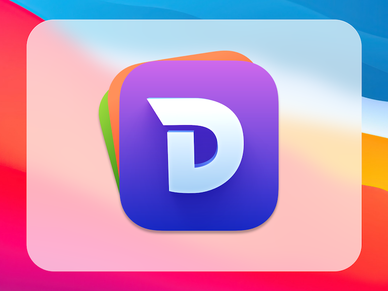
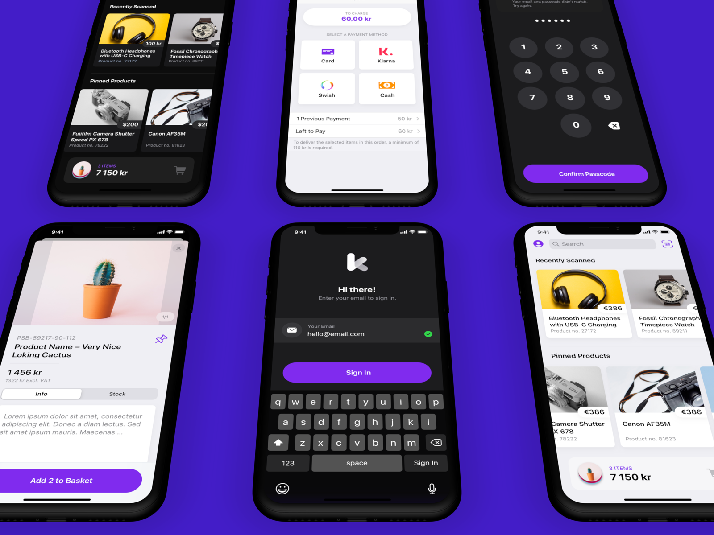
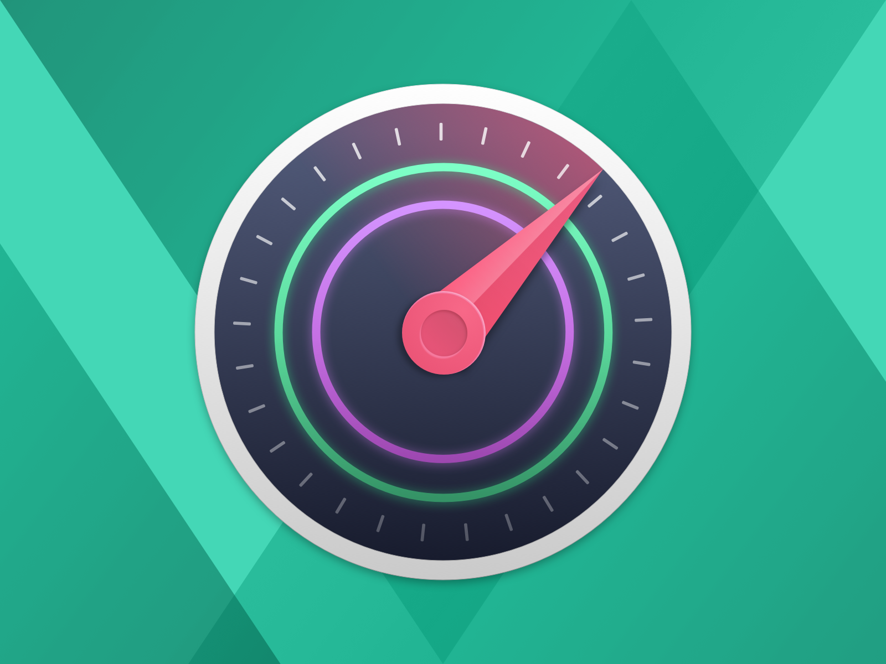
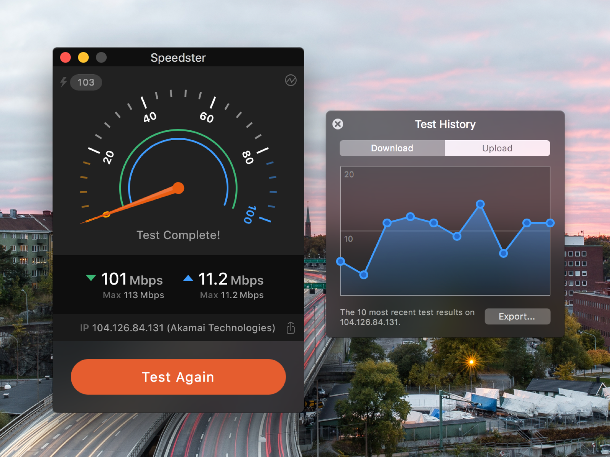
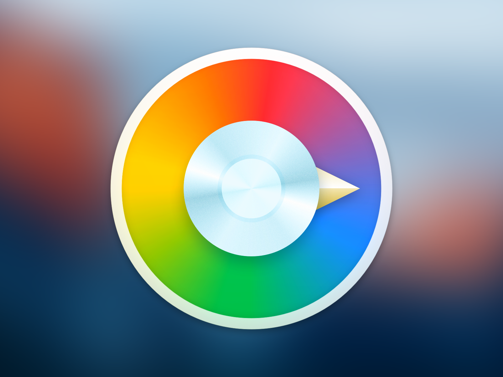
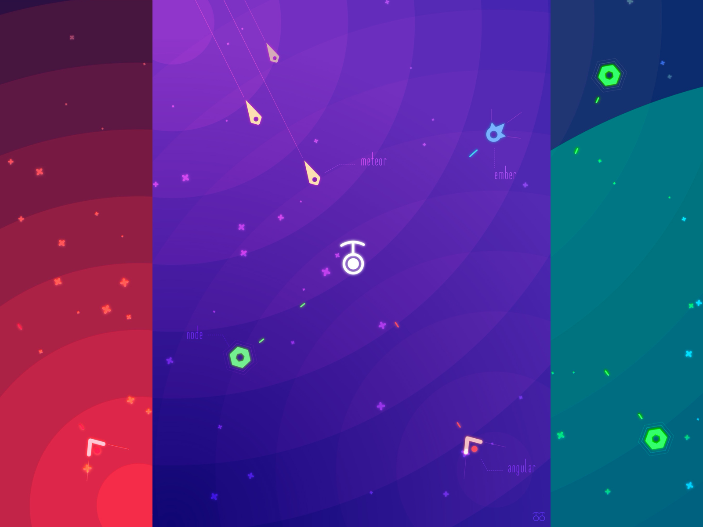
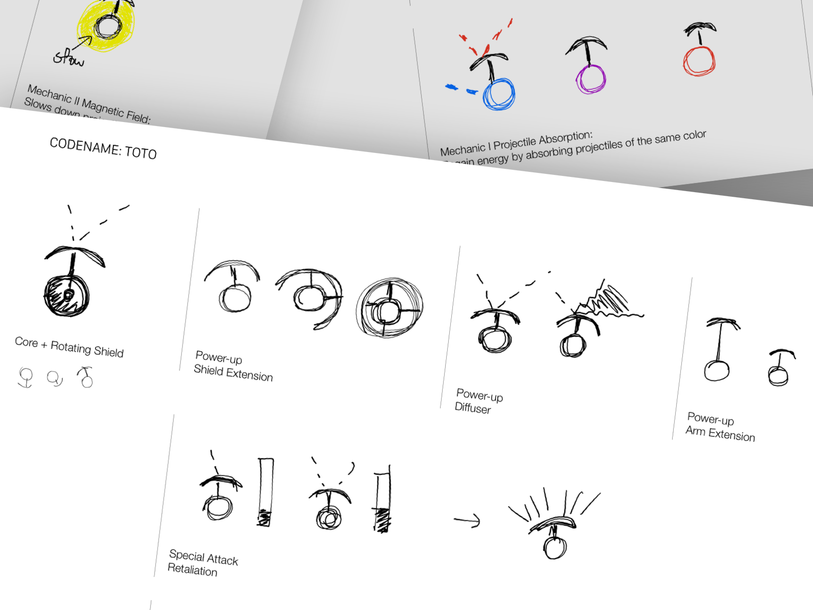
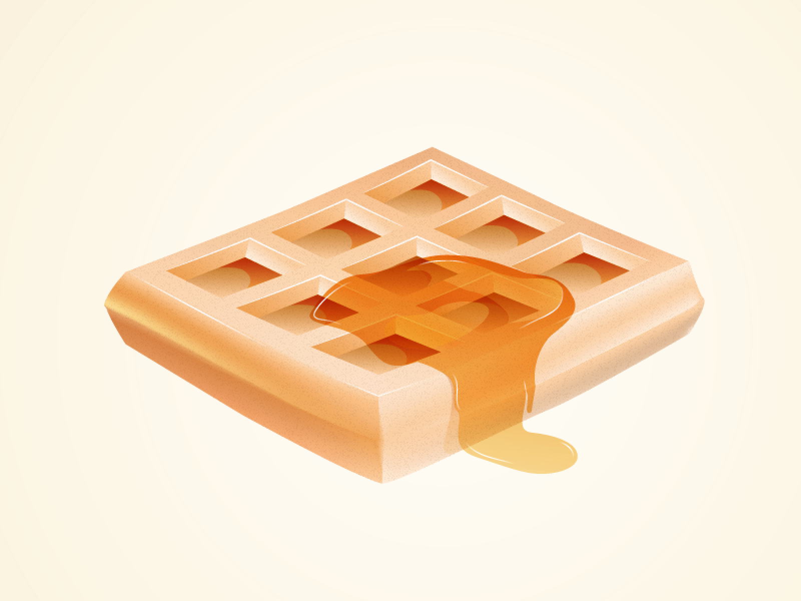

import DefaultLayout from '../../components/layouts/default';
import Seo from '../../components/seo';
import Helmet from 'react-helmet';
import PageHeader from '../../components/page-header';

<Seo title="Portfolio" />
<Helmet bodyAttributes={{ class: 'portfolio-page' }} />

<PageHeader title="Portfolio">

  A showcase of some of the design work I have done through the years. Please [get in touch](/contact) for further inquiries.

</PageHeader>

### 2020

In prepration for macOS Big Sur, I had the pleasure to work with Kapeli on a new icon for their
beloved [documentation viewing](https://kapeli.com/dash) for Mac.

During the last 3 years, I worked on Kaching's app protfolio for the retail industry in Sweden and abroad. The role involved
designing hundreds of screens and micro-intreactions, then evolved to leading the design and product teams to deliver, test,
and iterate on the product.

### 2017

### 2016

Designed and developed an Internet bandwidth testing app for macOS, née Speedster.

Designed and developed a color picker utility for macOS.

### 2015

In summer 2015 I had the opportunity to work on game design at thoughtbot Stockholm.
The result was a mobile game that I designed and made assets for.

### 2014

I designed the UI of Spogo, an iPhone app for sport bets (discontinued).

### 2012

Icon commissioned by [Alex Knight](https://alexknight.net).

export default DefaultLayout;

